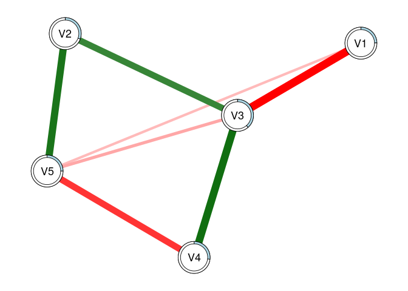

<!-- README.md is generated from README.Rmd. Please edit that file -->

# modnets

<!-- badges: start -->
<!-- badges: end -->

R package designed to afford exploratory and confirmatory estimation of
3 types of moderated networks:

1.  Cross-sectional moderated networks
    -   Involves nodewise estimation of a GGM with higher-order
        interactions
    -   Can accomodate any combination of continuous and binary
        variables.
    -   Nodewise regressions are fit using either OLS or logistic
        regression, depending on variable types.
2.  Idiographic (temporal) moderated networks
    -   Involves generalized least squares (GLS) estimation of
        multivariate time series model, as well as the
        inverse-covariance structure of the residuals.
    -   Currently only works for continuous variables, although
        exogenous moderators can be binary.
    -   Default estimation is seemingly unrelated regressions (SUR) via
        `systemfit`, but OLS is also available (unconstrained SUR
        estimates are equivalent to OLS estimates).
3.  Multi-level moderated networks
    -   Uses one of two methods for estimation.
    -   One is a two-step multilevel model, where fixed/random effects
        are estimated separately from between-subject effects
    -   The other uses a formal multilevel moderated vector
        autoregressive model with `lmer`
    -   Only works for continous variables, although exogenous
        moderators can be binary.

Penalized estimators for each of these models are also available, such
as the LASSO, ridge regression, elastic net, the (overlapping) group
LASSO, and the hierarchical LASSO. Hyperparameter selection will be
performed automatically based on either the AIC, BIC, EBIC, or
cross-validation depending upon user input.

## Installation

You can install the development version of modnets from
[GitHub](https://github.com/tswanson222/modnets) with:

``` r
# install.packages('devtools')
devtools::install_github('tswanson222/modnets')
```

## Usage

``` r
library(modnets)

data <- na.omit(psychTools::msq[, c('hostile', 'lonely', 'nervous', 'sleepy', 'depressed')])

fit <- fitNetwork(data, moderators = 'depressed')

plot(fit, threshold = TRUE)
```


## Package Functions

### Primary functions

-   The primary function used for the first two types of models is:
    `fitNetwork`. There are a variety of arguments and options that can
    be used for, e.g., penalized estimation, model specification, etc.
-   The primary functions used for the third model are: `mlGVAR` and
    `lmerVAR`, depending on which approach you wish to use.

### Model selection

-   For model selection, you can use `varSelect` to employ either
    best-subset selection (via `leaps`), the LASSO, ridge regression, or
    elastic net (via `glmnet`), or the hierarchical LASSO (via
    `glinternet`). These methods support various information criteria as
    well as cross-validation for model selection, and are embedded
    within the `varSelect` function.
-   As a note, all of the model selection procedures in `varSelect`
    operate on a sequential, nodewise basis.
-   Additionally, you can use the `resample` function to use repeated
    subsampling or bootstrapping with the `varSelect` algorithm built
    in.
-   This latter method will take into account the actual model-fit
    values (such as those obtained in the GLS-driven SUR for temporal
    networks)

### Stability & power analyses

-   Currently, these methods are not supported in the multilevel
    setting.
-   For bootstrapping/edge-weight accuracy analysis, you can use the
    `bootNet` function.
-   For case-dropping stability analysis, you can use `bootNet` while
    setting `caseDrop = TRUE`.
-   For power analysis, you can use: `mnetPowerSim` to simulate data
    based on expected network structure(s).

## Examples

### Cross-sectional moderated network

``` r
library(modnets)
# Package is now loaded! 

### ================================================ ###
### ======= SIMULATE MODERATED NETWORK DATA ======== ###
### ================================================ ###
# Can simulate data with no moderators, or with one exogenous moderator
set.seed(1)
x <- simNet(N = 500, p = 5, m = TRUE, sparsity = .5, nCores = TRUE, modType = 'full')
#> Time difference of 15.0086 secs
str(x)
#> List of 6
#>  $ data      :'data.frame':  500 obs. of  6 variables:
#>   ..$ V1: num [1:500] 0.441 0.613 1.444 1.911 -1.747 ...
#>   ..$ V2: num [1:500] 0.3462 -1.2625 -0.5549 -0.4488 -0.0309 ...
#>   ..$ V3: num [1:500] 2.354 -0.217 0.527 -0.57 -0.511 ...
#>   ..$ V4: num [1:500] 1.006 -1.056 1.505 0.113 -0.647 ...
#>   ..$ V5: num [1:500] -1.855 0.643 -0.257 -0.305 1.347 ...
#>   ..$ M : num [1:500] -1.001 0.203 -1.624 -0.749 -0.587 ...
#>  $ b1        : num [1:5, 1:5] 0 -0.261 0 0.236 -0.339 ...
#>   ..- attr(*, "dimnames")=List of 2
#>   .. ..$ : NULL
#>   .. ..$ : NULL
#>  $ b2        : num [1:5, 1:5] 0 0 0 0 0 ...
#>   ..- attr(*, "dimnames")=List of 2
#>   .. ..$ : NULL
#>   .. ..$ : NULL
#>  $ intercepts: num [1:5] 0 0 0 0 0
#>  $ m         : num -0.626
#>  $ m1        : num [1:5] 0 0 0 0 0
#>  - attr(*, "m2")= num 1
#>  - attr(*, "modType")= chr "full"
#>  - attr(*, "class")= chr [1:2] "list" "ggmSim"
#>  - attr(*, "time")= 'difftime' num 15.008318901062
#>   ..- attr(*, "units")= chr "secs"
### Contents:
# x$data -------- 100x6 dataset, where 'M' is the moderator
# x$b1 ---------- true regression coefficients, where columns --> rows
# x$b2 ---------- true interaction coefficients, where (M * columns) --> rows
# x$intercepts -- true intercepts; defaults to 0
# x$m ----------- true mean of 'M'
# x$m1 ---------- coefficents for main effects of M on outcomes; default to 0

head(x$data)
#>           V1         V2         V3         V4         V5          M
#> 1  0.4407660  0.3461739  2.3542186  1.0062685 -1.8554946 -1.0014073
#> 2  0.6130852 -1.2625130 -0.2170606 -1.0563246  0.6434497  0.2033182
#> 3  1.4436767 -0.5549074  0.5268885  1.5049433 -0.2565635 -1.6242819
#> 4  1.9114836 -0.4487851 -0.5704033  0.1125377 -0.3053743 -0.7489947
#> 5 -1.7473716 -0.0308543 -0.5106850 -0.6468791  1.3467493 -0.5867831
#> 6  0.2418482 -1.0049113  0.5179865  1.9085133  1.1700913 -1.3891705
print(x$b1)
#>            [,1]       [,2]     [,3]      [,4]       [,5]
#> [1,]  0.0000000 -0.2612726 0.000000 0.2355685 -0.3390689
#> [2,] -0.2612726  0.0000000 0.000000 0.0000000 -0.3132306
#> [3,]  0.0000000  0.0000000 0.000000 0.5175260  0.0000000
#> [4,]  0.2355685  0.0000000 0.517526 0.0000000  0.0000000
#> [5,] -0.3390689 -0.3132306 0.000000 0.0000000  0.0000000
print(x$b2)
#>      [,1]      [,2] [,3]      [,4] [,5]
#> [1,]    0 0.0000000    0 0.0000000    0
#> [2,]    0 0.0000000    0 0.2106073    0
#> [3,]    0 0.0000000    0 0.0000000    0
#> [4,]    0 0.2106073    0 0.0000000    0
#> [5,]    0 0.0000000    0 0.0000000    0
print(x$intercepts)
#> [1] 0 0 0 0 0
print(x$m)
#> [1] -0.6264538
print(x$m1)
#> [1] 0 0 0 0 0
dat0 <- x$data[, -6]
dat1 <- x$data
# First, lets save an object that excludes the moderator (dat0)
# and save a second with the moderator (dat1)


### ================================================ ###
### =============== FITTING MODELS ================= ###
### ================================================ ###
# First, lets fit an unmoderated network, leaving out 'M' entirely
fit0 <- fitNetwork(data = dat0) 

# Next, lets fit a model that only includes 'M' as a covariate
fit1 <- fitNetwork(data = dat1, covariates = 6) 

# Now, lets fit the saturated model where 'M' moderates all edges in the network
fit2 <- fitNetwork(data = dat1, moderators = 6) 


### ================= PLOTTING ===================== ###
plot(fit0)
```


``` r
plot(fit1)
```


``` r
plot(fit2)
```


``` r
# We can plot each of these models to see the resultant undirected network

plot(fit0, threshold = .05)
```


``` r
plot(fit1, threshold = .05)
```


``` r
plot(fit2, threshold = .05)
```


``` r
# Plot only significant edges (p < threshold) of the network.

plot(fit0, threshold = TRUE, predict = TRUE)
```


``` r
plot(fit1, threshold = TRUE, predict = 'R2')
```



``` r
plot(fit2, threshold = TRUE, predict = 'adjR2')
```


``` r
# Using 'threshold = TRUE' is the same as 'threshold = .05'
# 'predict = TRUE' plots R2 values for each regression
# This can also be specified as a string, as shown

plot(fit2, threshold = TRUE, predict = fit0)
```


``` r
# This can also be used to visually compare networks
# Here, the light blue ring around each node shows
# the R2 for 'fit0', while the slightly darker piece 
# shows the increase in R2 that we see with 'fit2'

predictNet(fit2)
#>   Variable    R2 adjR2   MSE  RMSE
#> 1       V1 0.284 0.271 0.986 0.993
#> 2       V2 0.204 0.189 0.974 0.987
#> 3       V3 0.282 0.269 1.048 1.024
#> 4       V4 0.415 0.404 1.012 1.006
#> 5       V5 0.190 0.175 0.873 0.935
predictNet(fit2, fit1)
#>   Variable    R2  adjR2    MSE   RMSE
#> 1       V1 0.001 -0.004  0.006  0.003
#> 2       V2 0.032  0.025 -0.030 -0.015
#> 3       V3 0.002 -0.004  0.005  0.003
#> 4       V4 0.055  0.050 -0.086 -0.042
#> 5       V5 0.002 -0.005  0.005  0.003
# We can extract these values using this function
# And can take the differences by supplying two networks
# Values for the second model are substracted by those from the first

plot(fit2, mnet = TRUE)
```


``` r
plot(fit2, threshold = TRUE, mnet = TRUE)
```


``` r
# 'mnet = TRUE' plots the exogenous moderator


### ============= VARIABLE SELECTION =============== ###
# These methods demonstrate the two-stage process for variable selection
# In the first stage, we use the data to select the active set of predictors
# In the second stage, we use those predictors to re-fit the models using OLS

### UNMODERATED NETWORKS
vars0 <- varSelect(data = dat0, criterion = 'BIC', method = 'glmnet')
#> =================================================================================================================================
vfit0 <- fitNetwork(data = dat0, type = vars0)
vfit1 <- fitNetwork(data = dat0, type = 'varSelect', criterion = 'BIC')
predictNet(vfit0, vfit1)
#>   Variable R2 adjR2 MSE RMSE
#> 1       V1  0     0   0    0
#> 2       V2  0     0   0    0
#> 3       V3  0     0   0    0
#> 4       V4  0     0   0    0
#> 5       V5  0     0   0    0
# In the first method, we use glmnet to perform variable selection for 
# each of the nodewise models. Then, we can subsequently include this in the
# 'fitNetwork' function. In the second approach, we can simply include everything
# in one command. We see that these produce the exact same models

vfit2 <- fitNetwork(data = dat0, type = 'varSelect', criterion = 'BIC', method = 'subset')
# We can also use best-subsets selection instead of the LASSO

predictNet(vfit2, vfit1)
#>   Variable R2 adjR2 MSE RMSE
#> 1       V1  0     0   0    0
#> 2       V2  0     0   0    0
#> 3       V3  0     0   0    0
#> 4       V4  0     0   0    0
#> 5       V5  0     0   0    0
# In this case, we see that best-subsets produced lower R2 for three nodes

vfit3 <- fitNetwork(data = dat0, type = 'varSelect', criterion = 'CV', seed = 1)
vfit3.1 <- fitNetwork(data = dat0, type = 'varSelect', criterion = 'CV', seed = 1)
vfit3.2 <- fitNetwork(data = dat0, type = 'varSelect', criterion = 'CV', seed = 99)
# We can also use cross-validation with glmnet (but not best-subsets)

predictNet(vfit3, vfit3.1)
#>   Variable R2 adjR2 MSE RMSE
#> 1       V1  0     0   0    0
#> 2       V2  0     0   0    0
#> 3       V3  0     0   0    0
#> 4       V4  0     0   0    0
#> 5       V5  0     0   0    0
predictNet(vfit3, vfit3.2)
#>   Variable     R2  adjR2    MSE   RMSE
#> 1       V1  0.000  0.000  0.000  0.000
#> 2       V2  0.000 -0.001  0.001  0.000
#> 3       V3  0.000 -0.002  0.003  0.002
#> 4       V4 -0.001  0.001 -0.001 -0.001
#> 5       V5  0.000  0.000  0.000  0.000
# We see that setting a seed leads to reproducible results


### MODERATED NETWORKS
vars1 <- varSelect(data = dat1, m = 6, criterion = 'BIC', method = 'glinternet')
#> Fitting model 1/5...  Complete! (0.05 secs)
#> Fitting model 2/5...  Complete! (0.11 secs)
#> Fitting model 3/5...  Complete! (0.04 secs)
#> Fitting model 4/5...  Complete! (0.08 secs)
#> Fitting model 5/5...  Complete! (0.04 secs)
#> ####### Total time: 0.33 secs
mfit1 <- fitNetwork(data = dat1, moderators = 6, type = vars1)
mfit2 <- fitNetwork(data = dat1, moderators = 6, type = 'varSelect', criterion = 'BIC')
predictNet(mfit1, mfit2)
#>   Variable R2 adjR2 MSE RMSE
#> 1       V1  0     0   0    0
#> 2       V2  0     0   0    0
#> 3       V3  0     0   0    0
#> 4       V4  0     0   0    0
#> 5       V5  0     0   0    0
# Again, we see that both methods produce the same model
# Creating the 'vars1' object separately can be useful when we wish
# to analyze the results from the variable selection process; plot outputs, obtain coefficients, etc.
# Also, all moderated networks use 'glinternet' as the selection method, and so it does not need to be specified

mfit2 <- fitNetwork(data = dat1, moderators = 6, type = 'varSelect', criterion = 'CV', seed = 1)
# We can use cross-validation with the glinternet algorithm as well


### ============== MODEL COMPARISON ================ ###
# Create a list of models we want to compare
fits <- list(fit0 = fit0, fit1 = fit1, fit2 = fit2, 
             vfit1 = vfit1, vfit2 = vfit2, vfit3 = vfit3,
             mfit1 = mfit1, mfit2 = mfit2)

modTable(fits)
#> $LRT
#>     net0  net1   Chisq Df   pval decision
#> 1   fit0  fit1  0.6084  5 0.9876     fit0
#> 2   fit0  fit2 40.5638 25 0.0255     fit2
#> 3  vfit1  fit0  5.1547  8 0.7409    vfit1
#> 4  vfit2  fit0  5.1547  8 0.7409    vfit2
#> 5  vfit3  fit0  1.1016  2 0.5765    vfit3
#> 6  mfit1  fit0 19.4096  3 0.0002    mfit1
#> 7  mfit2  fit0 19.9408  1 0.0000    mfit2
#> 8   fit1  fit2 39.9554 20 0.0051     fit2
#> 9  vfit1  fit1  5.7631 13 0.9544    vfit1
#> 10 vfit2  fit1  5.7631 13 0.9544    vfit2
#> 11 vfit3  fit1  1.7099  7 0.9741    vfit3
#> 12 mfit1  fit1 18.8013  8 0.0160    mfit1
#> 13 mfit2  fit1 19.3324  6 0.0036    mfit2
#> 14 vfit1  fit2 45.7185 33 0.0694    vfit1
#> 15 vfit2  fit2 45.7185 33 0.0694    vfit2
#> 16 vfit3  fit2 41.6653 27 0.0355     fit2
#> 17 mfit1  fit2 21.1542 28 0.8189    mfit1
#> 18 mfit2  fit2 20.6230 26 0.7612    mfit2
#> 19 vfit1 vfit2  0.0000  0 1.0000       - 
#> 20 vfit1 vfit3  4.0532  6 0.6695    vfit1
#> 21 vfit1 mfit1 24.5644  5 0.0002    mfit1
#> 22 vfit1 mfit2 25.0955  7 0.0007    mfit2
#> 23 vfit2 vfit3  4.0532  6 0.6695    vfit2
#> 24 vfit2 mfit1 24.5644  5 0.0002    mfit1
#> 25 vfit2 mfit2 25.0955  7 0.0007    mfit2
#> 26 mfit1 vfit3 20.5112  1 0.0000    mfit1
#> 27 vfit3 mfit2 21.0423  1 0.0000    mfit2
#> 28 mfit1 mfit2  0.5312  2 0.7668    mfit1
#> 
#> $omnibus
#>              LL df      AIC      BIC LRT
#> mfit1 -3335.471 23 6716.942 6850.895   7
#> mfit2 -3335.205 25 6720.411 6866.012   6
#> vfit1 -3347.753 18 6731.506 6836.339   4
#> vfit2 -3347.753 18 6731.506 6836.339   4
#> fit2  -3324.894 51 6751.788 7048.814   3
#> vfit3 -3345.726 24 6739.453 6879.230   2
#> fit0  -3345.176 26 6742.351 6893.776   1
#> fit1  -3344.871 31 6751.743 6932.288   0
#> 
#> attr(,"alpha")
#> [1] 0.05
# Performs likelihood ratio tests comparing each model with every other

modTable(fits)$omnibus
#>              LL df      AIC      BIC LRT
#> mfit1 -3335.471 23 6716.942 6850.895   7
#> mfit2 -3335.205 25 6720.411 6866.012   6
#> vfit1 -3347.753 18 6731.506 6836.339   4
#> vfit2 -3347.753 18 6731.506 6836.339   4
#> fit2  -3324.894 51 6751.788 7048.814   3
#> vfit3 -3345.726 24 6739.453 6879.230   2
#> fit0  -3345.176 26 6742.351 6893.776   1
#> fit1  -3344.871 31 6751.743 6932.288   0
# This shows us the final results. The 'LRT' column indicates
# the total number of times each model was selected across all tests
# We can see that 'fit2' (the saturated MNM) was selected across all tests
# The second-most selected was 'mfit2', which used glinternet with CV selection

modTable(fits, nodes = TRUE)
#> $nodes
#> $nodes$V1
#>              LL  df      AIC      BIC
#> fit0  -701.3661 495 1414.732 1440.020
#> fit1  -701.3480 494 1416.696 1446.198
#> fit2  -700.7754 490 1423.551 1469.912
#> vfit1 -701.4447 496 1412.889 1433.962
#> vfit2 -701.4447 496 1412.889 1433.962
#> vfit3 -701.3661 495 1414.732 1440.020
#> mfit1 -701.4447 496 1412.889 1433.962
#> mfit2 -701.4447 496 1412.889 1433.962
#> 
#> $nodes$V2
#>              LL  df      AIC      BIC
#> fit0  -707.5782 495 1427.156 1452.444
#> fit1  -707.5698 494 1429.140 1458.642
#> fit2  -697.9513 490 1417.903 1464.263
#> vfit1 -707.8113 496 1425.623 1446.696
#> vfit2 -707.8113 496 1425.623 1446.696
#> vfit3 -707.5782 495 1427.156 1452.444
#> mfit1 -698.8344 494 1411.669 1441.171
#> mfit2 -698.8344 494 1411.669 1441.171
#> 
#> $nodes$V3
#>              LL  df      AIC      BIC
#> fit0  -717.1723 495 1446.345 1471.632
#> fit1  -716.9076 494 1447.815 1477.317
#> fit2  -716.1963 490 1454.393 1500.753
#> vfit1 -718.6268 498 1443.254 1455.898
#> vfit2 -718.6268 498 1443.254 1455.898
#> vfit3 -717.1723 495 1446.345 1471.632
#> mfit1 -718.6268 498 1443.254 1455.898
#> mfit2 -717.4298 497 1442.860 1459.718
#> 
#> $nodes$V4
#>              LL  df      AIC      BIC
#> fit0  -729.7742 495 1471.548 1496.836
#> fit1  -729.7603 494 1473.521 1503.023
#> fit2  -707.5124 490 1437.025 1483.385
#> vfit1 -730.0496 496 1470.099 1491.172
#> vfit2 -730.0496 496 1470.099 1491.172
#> vfit3 -730.0496 496 1470.099 1491.172
#> mfit1 -708.3456 493 1432.691 1466.408
#> mfit2 -707.9878 492 1433.976 1471.907
#> 
#> $nodes$V5
#>              LL  df      AIC      BIC
#> fit0  -671.1034 495 1354.207 1379.494
#> fit1  -671.1006 494 1356.201 1385.704
#> fit2  -670.5738 490 1363.148 1409.508
#> vfit1 -671.7934 497 1351.587 1368.445
#> vfit2 -671.7934 497 1351.587 1368.445
#> vfit3 -671.3787 496 1352.757 1373.831
#> mfit1 -671.7934 497 1351.587 1368.445
#> mfit2 -671.7934 497 1351.587 1368.445
#> 
#> 
#> $LRT
#> $LRT$LL_diff2
#>     net0  net1 |         V1          V2        V3          V4          V5
#> 1   fit0  fit1 | 0.03632787  0.01697362 0.5294676  0.02775566 0.005436351
#> 2   fit0  fit2 | 1.18139063 19.25380816 1.9520657 44.52364227 1.059072328
#> 3  vfit1  fit0 | 0.15718400  0.46602855 2.9090355  0.55077619 1.380162960
#> 4  vfit2  fit0 | 0.15718400  0.46602855 2.9090355  0.55077619 1.380162960
#> 5  vfit3  fit0 | 0.00000000  0.00000000 0.0000000  0.55077619 0.550776194
#> 6  mfit1  fit0 | 0.15718400 17.48770620 2.9090355 42.85722801 1.380162960
#> 7  mfit2  fit0 | 0.15718400 17.48770620 0.5150341 43.57289558 1.380162960
#> 8   fit1  fit2 | 1.14506276 19.23683453 1.4225980 44.49588661 1.053635978
#> 9  vfit1  fit1 | 0.19351187  0.48300218 3.4385031  0.57853185 1.385599311
#> 10 vfit2  fit1 | 0.19351187  0.48300218 3.4385031  0.57853185 1.385599311
#> 11 vfit3  fit1 | 0.03632787  0.01697362 0.5294676  0.57853185 0.556212545
#> 12 mfit1  fit1 | 0.19351187 17.47073258 3.4385031 42.82947235 1.385599311
#> 13 mfit2  fit1 | 0.19351187 17.47073258 1.0445017 43.54513992 1.385599311
#> 14 vfit1  fit2 | 1.33857463 19.71983671 4.8611011 45.07441846 2.439235288
#> 15 vfit2  fit2 | 1.33857463 19.71983671 4.8611011 45.07441846 2.439235288
#> 16 vfit3  fit2 | 1.18139063 19.25380816 1.9520657 45.07441846 1.609848522
#> 17 mfit1  fit2 | 1.33857463  1.76610195 4.8611011  1.66641425 2.439235288
#> 18 mfit2  fit2 | 1.33857463  1.76610195 2.4670998  0.95074668 2.439235288
#> 19 vfit1 vfit2 | 0.00000000  0.00000000 0.0000000  0.00000000 0.000000000
#> 20 vfit1 vfit3 | 0.15718400  0.46602855 2.9090355  0.00000000 0.829386766
#> 21 vfit1 mfit1 | 0.00000000 17.95373476 0.0000000 43.40800421 0.000000000
#> 22 vfit1 mfit2 | 0.00000000 17.95373476 2.3940014 44.12367178 0.000000000
#> 23 vfit2 vfit3 | 0.15718400  0.46602855 2.9090355  0.00000000 0.829386766
#> 24 vfit2 mfit1 | 0.00000000 17.95373476 0.0000000 43.40800421 0.000000000
#> 25 vfit2 mfit2 | 0.00000000 17.95373476 2.3940014 44.12367178 0.000000000
#> 26 mfit1 vfit3 | 0.15718400 17.48770620 2.9090355 43.40800421 0.829386766
#> 27 vfit3 mfit2 | 0.15718400 17.48770620 0.5150341 44.12367178 0.829386766
#> 28 mfit1 mfit2 | 0.00000000  0.00000000 2.3940014  0.71566757 0.000000000
#> 
#> $LRT$Df_diff
#>     net0  net1 | V1 V2 V3 V4 V5
#> 1   fit0  fit1 |  1  1  1  1  1
#> 2   fit0  fit2 |  5  5  5  5  5
#> 3  vfit1  fit0 |  1  1  3  1  2
#> 4  vfit2  fit0 |  1  1  3  1  2
#> 5  vfit3  fit0 |  0  0  0  1  1
#> 6  mfit1  fit0 |  1  1  3  2  2
#> 7  mfit2  fit0 |  1  1  2  3  2
#> 8   fit1  fit2 |  4  4  4  4  4
#> 9  vfit1  fit1 |  2  2  4  2  3
#> 10 vfit2  fit1 |  2  2  4  2  3
#> 11 vfit3  fit1 |  1  1  1  2  2
#> 12 mfit1  fit1 |  2  0  4  1  3
#> 13 mfit2  fit1 |  2  0  3  2  3
#> 14 vfit1  fit2 |  6  6  8  6  7
#> 15 vfit2  fit2 |  6  6  8  6  7
#> 16 vfit3  fit2 |  5  5  5  6  6
#> 17 mfit1  fit2 |  6  4  8  3  7
#> 18 mfit2  fit2 |  6  4  7  2  7
#> 19 vfit1 vfit2 |  0  0  0  0  0
#> 20 vfit1 vfit3 |  1  1  3  0  1
#> 21 vfit1 mfit1 |  0  2  0  3  0
#> 22 vfit1 mfit2 |  0  2  1  4  0
#> 23 vfit2 vfit3 |  1  1  3  0  1
#> 24 vfit2 mfit1 |  0  2  0  3  0
#> 25 vfit2 mfit2 |  0  2  1  4  0
#> 26 mfit1 vfit3 |  1  1  3  3  1
#> 27 vfit3 mfit2 |  1  1  2  4  1
#> 28 mfit1 mfit2 |  0  0  1  1  0
#> 
#> $LRT$pval
#>     net0  net1 |     V1     V2     V3     V4     V5
#> 1   fit0  fit1 | 0.8488 0.8963 0.4668 0.8677 0.9412
#> 2   fit0  fit2 | 0.9467 0.0017 0.8557 0.0000 0.9577
#> 3  vfit1  fit0 | 0.6918 0.4948 0.4059 0.4580 0.5015
#> 4  vfit2  fit0 | 0.6918 0.4948 0.4059 0.4580 0.5015
#> 5  vfit3  fit0 | 1.0000 1.0000 1.0000 0.4580 0.4580
#> 6  mfit1  fit0 | 0.6918 0.0000 0.4059 0.0000 0.5015
#> 7  mfit2  fit0 | 0.6918 0.0000 0.7730 0.0000 0.5015
#> 8   fit1  fit2 | 0.8871 0.0007 0.8403 0.0000 0.9016
#> 9  vfit1  fit1 | 0.9078 0.7854 0.4873 0.7488 0.7089
#> 10 vfit2  fit1 | 0.9078 0.7854 0.4873 0.7488 0.7089
#> 11 vfit3  fit1 | 0.8488 0.8963 0.4668 0.7488 0.7572
#> 12 mfit1  fit1 | 0.9078 0.0000 0.4873 0.0000 0.7089
#> 13 mfit2  fit1 | 0.9078 0.0000 0.7905 0.0000 0.7089
#> 14 vfit1  fit2 | 0.9695 0.0031 0.7723 0.0000 0.9316
#> 15 vfit2  fit2 | 0.9695 0.0031 0.7723 0.0000 0.9316
#> 16 vfit3  fit2 | 0.9467 0.0017 0.8557 0.0000 0.9519
#> 17 mfit1  fit2 | 0.9695 0.7787 0.7723 0.6444 0.9316
#> 18 mfit2  fit2 | 0.9695 0.7787 0.9296 0.6217 0.9316
#> 19 vfit1 vfit2 | 1.0000 1.0000 1.0000 1.0000 1.0000
#> 20 vfit1 vfit3 | 0.6918 0.4948 0.4059 1.0000 0.3624
#> 21 vfit1 mfit1 | 1.0000 0.0001 1.0000 0.0000 1.0000
#> 22 vfit1 mfit2 | 1.0000 0.0001 0.1218 0.0000 1.0000
#> 23 vfit2 vfit3 | 0.6918 0.4948 0.4059 1.0000 0.3624
#> 24 vfit2 mfit1 | 1.0000 0.0001 1.0000 0.0000 1.0000
#> 25 vfit2 mfit2 | 1.0000 0.0001 0.1218 0.0000 1.0000
#> 26 mfit1 vfit3 | 0.6918 0.0000 0.4059 0.0000 0.3624
#> 27 vfit3 mfit2 | 0.6918 0.0000 0.7730 0.0000 0.3624
#> 28 mfit1 mfit2 | 1.0000 1.0000 0.1218 0.3976 1.0000
#> 
#> $LRT$decision
#>     net0  net1 |    V1    V2    V3    V4    V5
#> 1   fit0  fit1 |  fit0  fit0  fit0  fit0  fit0
#> 2   fit0  fit2 |  fit0  fit2  fit0  fit2  fit0
#> 3  vfit1  fit0 | vfit1 vfit1 vfit1 vfit1 vfit1
#> 4  vfit2  fit0 | vfit2 vfit2 vfit2 vfit2 vfit2
#> 5  vfit3  fit0 |    -     -     -  vfit3 vfit3
#> 6  mfit1  fit0 | mfit1 mfit1 mfit1 mfit1 mfit1
#> 7  mfit2  fit0 | mfit2 mfit2 mfit2 mfit2 mfit2
#> 8   fit1  fit2 |  fit1  fit2  fit1  fit2  fit1
#> 9  vfit1  fit1 | vfit1 vfit1 vfit1 vfit1 vfit1
#> 10 vfit2  fit1 | vfit2 vfit2 vfit2 vfit2 vfit2
#> 11 vfit3  fit1 | vfit3 vfit3 vfit3 vfit3 vfit3
#> 12 mfit1  fit1 | mfit1 mfit1 mfit1 mfit1 mfit1
#> 13 mfit2  fit1 | mfit2 mfit2 mfit2 mfit2 mfit2
#> 14 vfit1  fit2 | vfit1  fit2 vfit1  fit2 vfit1
#> 15 vfit2  fit2 | vfit2  fit2 vfit2  fit2 vfit2
#> 16 vfit3  fit2 | vfit3  fit2 vfit3  fit2 vfit3
#> 17 mfit1  fit2 | mfit1 mfit1 mfit1 mfit1 mfit1
#> 18 mfit2  fit2 | mfit2 mfit2 mfit2 mfit2 mfit2
#> 19 vfit1 vfit2 |    -     -     -     -     - 
#> 20 vfit1 vfit3 | vfit1 vfit1 vfit1    -  vfit1
#> 21 vfit1 mfit1 |    -  mfit1    -  mfit1    - 
#> 22 vfit1 mfit2 |    -  mfit2 vfit1 mfit2    - 
#> 23 vfit2 vfit3 | vfit2 vfit2 vfit2    -  vfit2
#> 24 vfit2 mfit1 |    -  mfit1    -  mfit1    - 
#> 25 vfit2 mfit2 |    -  mfit2 vfit2 mfit2    - 
#> 26 mfit1 vfit3 | mfit1 mfit1 mfit1 mfit1 mfit1
#> 27 vfit3 mfit2 | mfit2 mfit2 mfit2 mfit2 mfit2
#> 28 mfit1 mfit2 |    -     -  mfit1 mfit1    - 
#> 
#> 
#> $counts
#>       V1 V2 V3 V4 V5
#> fit0   2  1  2  1  2
#> fit1   1  0  1  0  1
#> fit2   0  5  0  5  0
#> vfit1  4  3  5  2  4
#> vfit2  4  3  5  2  4
#> vfit3  2  1  2  2  3
#> mfit1  4  6  5  7  4
#> mfit2  4  6  4  6  4
#> 
#> attr(,"alpha")
#> [1] 0.05
# This does the same thing as above but at the nodewise level
```

More examples to be added soon.

Please contact <trevorswanson222@gmail.com> with any questions.
