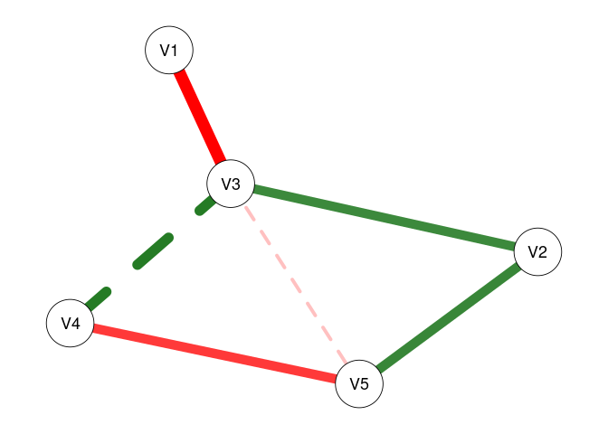
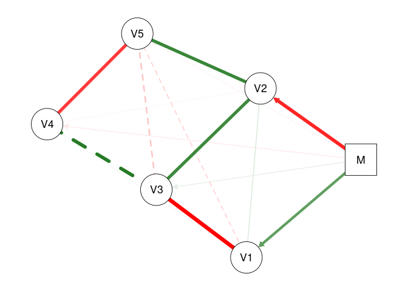

<!-- README.md is generated from README.Rmd. Please edit that file -->

# modnets

<!-- badges: start -->
<!-- badges: end -->

R package designed to afford exploratory and confirmatory estimation of
3 types of moderated networks:

1.  Cross-sectional moderated networks
    -   Involves nodewise estimation of a GGM with higher-order
        interactions
    -   Can accomodate any combination of continuous and binary
        variables.
    -   Nodewise regressions are fit using either OLS or logistic
        regression, depending on variable types.
2.  Idiographic (temporal) moderated networks
    -   Involves generalized least squares (GLS) estimation of
        multivariate time series model, as well as the
        inverse-covariance structure of the residuals.
    -   Currently only works for continuous variables, although
        exogenous moderators can be binary.
    -   Default estimation is seemingly unrelated regressions (SUR) via
        `systemfit`, but OLS is also available (unconstrained SUR
        estimates are equivalent to OLS estimates).
3.  Multi-level moderated networks
    -   Uses one of two methods for estimation.
    -   One is a two-step multilevel model, where fixed/random effects
        are estimated separately from between-subject effects
    -   The other uses a formal multilevel moderated vector
        autoregressive model with `lmer`
    -   Only works for continuous variables, although exogenous
        moderators can be binary.

Additionally, model selection techniques based on penalized regression
and iterative resampling are implemented alongside a variety of plotting
and data-generating functions.

## Installation

You can install the development version of modnets from
[GitHub](https://github.com/tswanson222/modnets) with:

``` r
# install.packages('devtools')
devtools::install_github('tswanson222/modnets')
```

## Usage

``` r
library(modnets)

data <- na.omit(psychTools::msq[, c('hostile', 'lonely', 'nervous', 'sleepy', 'depressed')])

fit <- fitNetwork(data, moderators = 'depressed')

plot(fit, threshold = TRUE)
```


## Package Functions

### Primary functions

-   The primary function used for the first two types of models is:
    `fitNetwork`. There are a variety of arguments and options that can
    be used for, e.g., penalized estimation, model specification, etc.
-   The primary functions used for the third model are: `mlGVAR` and
    `lmerVAR`, depending on which approach you wish to use.

### Model selection

-   For model selection, you can use `varSelect` to employ either
    best-subset selection (via `leaps`), the LASSO, ridge regression, or
    elastic net (via `glmnet`), or the hierarchical LASSO (via
    `glinternet`). These methods support various information criteria as
    well as cross-validation for model selection, and are embedded
    within the `varSelect` function.
-   As a note, all of the model selection procedures in `varSelect`
    operate on a sequential, nodewise basis.
-   Additionally, you can use the `resample` function to use repeated
    subsampling or bootstrapping with the `varSelect` algorithm built
    in.
-   This latter method will take into account the actual model-fit
    values (such as those obtained in the GLS-driven SUR for temporal
    networks)

### Stability & power analyses

-   Currently, these methods are not supported in the multilevel
    setting.
-   For bootstrapping/edge-weight accuracy analysis, you can use the
    `bootNet` function.
-   For case-dropping stability analysis, you can use `bootNet` while
    setting `caseDrop = TRUE`.
-   For power analysis, you can use: `mnetPowerSim` to simulate data
    based on expected network structure(s).

See the package description for an overview of these and other core
functions.

``` r
library(modnets)
?modnets
```

## Examples

### Cross-sectional moderated network

``` r
library(modnets)
# Package is now loaded! 

### ================================================ ###
### ======= SIMULATE MODERATED NETWORK DATA ======== ###
### ================================================ ###
# Can simulate data with no moderators, or with one exogenous moderator
set.seed(123)
x <- simNet(N = 500, p = 5, m = TRUE, m1 = .5, m2 = .2, nCores = TRUE)
#> Time difference of 19.52364 secs
str(x)
#> List of 6
#>  $ data      :'data.frame':  500 obs. of  6 variables:
#>   ..$ V1: num [1:500] 0.326 -1.323 1.367 -0.271 -1.713 ...
#>   ..$ V2: num [1:500] 0.185 0.597 -0.51 2.419 0.853 ...
#>   ..$ V3: num [1:500] -0.144 0.869 -0.246 1.919 -0.772 ...
#>   ..$ V4: num [1:500] 1.558 1.147 -0.602 1.287 -2.371 ...
#>   ..$ V5: num [1:500] -0.1574 0.9102 1.2682 0.7331 -0.0415 ...
#>   ..$ M : num [1:500] 0.19 -0.393 1.694 -1.472 -0.231 ...
#>  $ b1        : num [1:5, 1:5] 0 0 -0.445 0 0 ...
#>   ..- attr(*, "dimnames")=List of 2
#>   .. ..$ : NULL
#>   .. ..$ : NULL
#>  $ b2        : num [1:5, 1:5] 0 0 0 0 0.193 ...
#>   ..- attr(*, "dimnames")=List of 2
#>   .. ..$ : NULL
#>   .. ..$ : NULL
#>  $ intercepts: num [1:5] 0 0 0 0 0
#>  $ m         : num -0.56
#>  $ m1        : num [1:5] 0.233 -0.34 -0.137 0 -0.162
#>  - attr(*, "m2")= num 2
#>  - attr(*, "modType")= chr "none"
#>  - attr(*, "class")= chr [1:2] "list" "ggmSim"
#>  - attr(*, "time")= 'difftime' num 19.5232479572296
#>   ..- attr(*, "units")= chr "secs"
### Contents:
# x$data -------- 500x6 dataset, where 'M' is the moderator
# x$b1 ---------- true regression coefficients, where columns --> rows
# x$b2 ---------- true interaction coefficients, where (M * columns) --> rows
# x$intercepts -- true intercepts; defaults to 0
# x$m ----------- true mean of 'M'
# x$m1 ---------- coefficents for main effects of M on outcomes; default to 0

head(x$data)
#>           V1         V2         V3         V4          V5          M
#> 1  0.3260922  0.1849679 -0.1437791  1.5577303 -0.15738491  0.1901201
#> 2 -1.3228519  0.5973905  0.8689006  1.1472617  0.91024329 -0.3933698
#> 3  1.3666089 -0.5102097 -0.2461312 -0.6022788  1.26820364  1.6944774
#> 4 -0.2705904  2.4190012  1.9192734  1.2874252  0.73312936 -1.4722145
#> 5 -1.7127122  0.8531956 -0.7722504 -2.3711898 -0.04150314 -0.2311334
#> 6 -0.8362232 -2.2612296 -0.8060215 -1.4655291  0.71547576  0.8467195
print(x$b1)
#>           [,1]      [,2]       [,3]       [,4]       [,5]
#> [1,]  0.000000 0.0000000 -0.4449240  0.0000000  0.0000000
#> [2,]  0.000000 0.0000000  0.2829328  0.0000000  0.3307213
#> [3,] -0.444924 0.2829328  0.0000000  0.2991120  0.0000000
#> [4,]  0.000000 0.0000000  0.2991120  0.0000000 -0.3089766
#> [5,]  0.000000 0.3307213  0.0000000 -0.3089766  0.0000000
print(x$b2)
#>           [,1] [,2]      [,3] [,4]      [,5]
#> [1,] 0.0000000    0 0.0000000    0 0.1931925
#> [2,] 0.0000000    0 0.0000000    0 0.0000000
#> [3,] 0.0000000    0 0.0000000    0 0.2715655
#> [4,] 0.0000000    0 0.0000000    0 0.0000000
#> [5,] 0.1931925    0 0.2715655    0 0.0000000
print(x$intercepts)
#> [1] 0 0 0 0 0
print(x$m)
#> [1] -0.5604756
print(x$m1)
#> [1]  0.2326600 -0.3396775 -0.1365698  0.0000000 -0.1619594
dat0 <- x$data[, -6]
dat1 <- x$data
# First, lets save an object that excludes the moderator (dat0)
# and save a second with the moderator (dat1)


### ================================================ ###
### =============== FITTING MODELS ================= ###
### ================================================ ###
# First, lets fit an unmoderated network, leaving out 'M' entirely
fit0 <- fitNetwork(data = dat0) 

# Next, lets fit a model that only includes 'M' as a covariate
fit1 <- fitNetwork(data = dat1, covariates = 6) 

# Now, lets fit the saturated model where 'M' moderates all edges in the network
fit2 <- fitNetwork(data = dat1, moderators = 6) 


### ================= PLOTTING ===================== ###
plot(fit0)
```


``` r
plot(fit1)
```


``` r
plot(fit2)
```


``` r
# We can plot each of these models to see the resultant undirected network

plot(fit0, threshold = .05)
```


``` r
plot(fit1, threshold = .05)
```


``` r
plot(fit2, threshold = .05)
```



``` r
# Plot only significant edges (p < threshold) of the network.

plot(fit0, threshold = TRUE, predict = TRUE)
```


``` r
plot(fit1, threshold = TRUE, predict = 'R2')
```


``` r
plot(fit2, threshold = TRUE, predict = 'adjR2')
```


``` r
# Using 'threshold = TRUE' is the same as 'threshold = .05'
# 'predict = TRUE' plots R2 values for each regression
# This can also be specified as a string, as shown

plot(fit2, threshold = TRUE, predict = fit0)
```


``` r
# This can also be used to visually compare networks
# Here, the light blue ring around each node shows
# the R2 for 'fit0', while the slightly darker piece 
# shows the increase in R2 that we see with 'fit2'

predictNet(fit2)
#>   Variable    R2 adjR2   MSE  RMSE
#> 1       V1 0.306 0.293 1.015 1.007
#> 2       V2 0.311 0.298 1.067 1.033
#> 3       V3 0.434 0.424 1.040 1.020
#> 4       V4 0.255 0.241 1.050 1.024
#> 5       V5 0.312 0.300 0.997 0.998
predictNet(fit2, fit0)
#>   Variable    R2 adjR2    MSE   RMSE
#> 1       V1 0.073 0.066 -0.095 -0.047
#> 2       V2 0.069 0.062 -0.095 -0.045
#> 3       V3 0.072 0.067 -0.120 -0.057
#> 4       V4 0.020 0.012 -0.017 -0.009
#> 5       V5 0.075 0.070 -0.098 -0.049
# We can extract these values using this function
# And can take the differences by supplying two networks
# Values for the second model are subtracted from those for the first

plot(fit2, mnet = TRUE)
```



``` r
plot(fit2, threshold = TRUE, mnet = TRUE)
```


``` r
# 'mnet = TRUE' plots the exogenous moderator


### ============= VARIABLE SELECTION =============== ###
# These methods demonstrate the two-stage process for variable selection
# In the first stage, we use the data to select the active set of predictors
# In the second stage, we use those predictors to re-fit the models using OLS

### UNMODERATED NETWORKS
vars0 <- varSelect(data = dat0, criterion = 'BIC', method = 'glmnet')
#> =================================================================================================================================
vfit0 <- fitNetwork(data = dat0, type = vars0)
vfit1 <- fitNetwork(data = dat0, type = 'varSelect', criterion = 'BIC')
predictNet(vfit0, vfit1)
#>   Variable R2 adjR2 MSE RMSE
#> 1       V1  0     0   0    0
#> 2       V2  0     0   0    0
#> 3       V3  0     0   0    0
#> 4       V4  0     0   0    0
#> 5       V5  0     0   0    0
# In the first method, we use glmnet to perform variable selection for 
# each of the nodewise models. Then, we can subsequently include this in the
# 'fitNetwork' function. In the second approach, we can simply include everything
# in one command. We see that these produce the exact same models

vfit2 <- fitNetwork(data = dat0, type = 'varSelect', criterion = 'BIC', method = 'subset')
# We can also use best-subsets selection instead of the LASSO

predictNet(vfit2, vfit1)
#>   Variable     R2  adjR2   MSE  RMSE
#> 1       V1 -0.004 -0.002 0.003 0.001
#> 2       V2 -0.010 -0.007 0.010 0.005
#> 3       V3 -0.004 -0.003 0.005 0.002
#> 4       V4 -0.007 -0.005 0.006 0.003
#> 5       V5 -0.011 -0.007 0.011 0.005
# In this case, we see that best-subsets produced lower R2 for three nodes

vfit3 <- fitNetwork(data = dat0, type = 'varSelect', criterion = 'CV', seed = 1)
vfit3.1 <- fitNetwork(data = dat0, type = 'varSelect', criterion = 'CV', seed = 1)
vfit3.2 <- fitNetwork(data = dat0, type = 'varSelect', criterion = 'CV', seed = 99)
# We can also use cross-validation with glmnet (but not best-subsets)

predictNet(vfit3, vfit3.1)
#>   Variable R2 adjR2 MSE RMSE
#> 1       V1  0     0   0    0
#> 2       V2  0     0   0    0
#> 3       V3  0     0   0    0
#> 4       V4  0     0   0    0
#> 5       V5  0     0   0    0
predictNet(vfit3, vfit3.2)
#>   Variable R2 adjR2 MSE RMSE
#> 1       V1  0     0   0    0
#> 2       V2  0     0   0    0
#> 3       V3  0     0   0    0
#> 4       V4  0     0   0    0
#> 5       V5  0     0   0    0
# We see that setting a seed leads to reproducible results


### MODERATED NETWORKS
vars1 <- varSelect(data = dat1, m = 6, criterion = 'BIC', method = 'glinternet')
#> Fitting model 1/5...  Complete! (0.08 secs)
#> Fitting model 2/5...  Complete! (0.14 secs)
#> Fitting model 3/5...  Complete! (0.08 secs)
#> Fitting model 4/5...  Complete! (0.1 secs)
#> Fitting model 5/5...  Complete! (0.08 secs)
#> ####### Total time: 0.49 secs
mfit1 <- fitNetwork(data = dat1, moderators = 6, type = vars1)
mfit2 <- fitNetwork(data = dat1, moderators = 6, type = 'varSelect', criterion = 'BIC')
predictNet(mfit1, mfit2)
#>   Variable R2 adjR2 MSE RMSE
#> 1       V1  0     0   0    0
#> 2       V2  0     0   0    0
#> 3       V3  0     0   0    0
#> 4       V4  0     0   0    0
#> 5       V5  0     0   0    0
# Again, we see that both methods produce the same model
# Creating the 'vars1' object separately can be useful when we wish
# to analyze the results from the variable selection process; plot outputs, obtain coefficients, etc.
# Also, all moderated networks use 'glinternet' as the selection method, and so it does not need to be specified

mfit2 <- fitNetwork(data = dat1, moderators = 6, type = 'varSelect', criterion = 'CV', seed = 1)
# We can use cross-validation with the glinternet algorithm as well


### ============== MODEL COMPARISON ================ ###
# Create a list of models we want to compare
fits <- list(fit0 = fit0, fit1 = fit1, fit2 = fit2, 
             vfit1 = vfit1, vfit2 = vfit2, vfit3 = vfit3,
             mfit1 = mfit1, mfit2 = mfit2)

modTable(fits)
#> $LRT
#>     net0  net1    Chisq Df   pval decision
#> 1   fit0  fit1  30.4276  5 0.0000     fit1
#> 2   fit0  fit2 212.5038 25 0.0000     fit2
#> 3  vfit1  fit0   0.1737  2 0.9168    vfit1
#> 4  vfit2  fit0  29.1382  9 0.0006     fit0
#> 5  vfit3  fit0   0.1737  2 0.9168    vfit3
#> 6   fit0 mfit1 156.0641  5 0.0000    mfit1
#> 7   fit0 mfit2 213.5467 21 0.0000    mfit2
#> 8   fit1  fit2 182.0762 20 0.0000     fit2
#> 9  vfit1  fit1  30.6013  7 0.0001     fit1
#> 10 vfit2  fit1  59.5658 14 0.0000     fit1
#> 11 vfit3  fit1  30.6013  7 0.0001     fit1
#> 12  fit1 mfit1 125.6365  0 0.0000    mfit1
#> 13  fit1 mfit2 183.1191 16 0.0000    mfit2
#> 14 vfit1  fit2 212.6774 27 0.0000     fit2
#> 15 vfit2  fit2 241.6419 34 0.0000     fit2
#> 16 vfit3  fit2 212.6774 27 0.0000     fit2
#> 17 mfit1  fit2  56.4397 20 0.0000     fit2
#> 18 mfit2  fit2   1.0430  4 0.9032    mfit2
#> 19 vfit2 vfit1  28.9645  7 0.0001    vfit1
#> 20 vfit1 vfit3   0.0000  0 1.0000       - 
#> 21 vfit1 mfit1 156.2377  7 0.0000    mfit1
#> 22 vfit1 mfit2 213.7204 23 0.0000    mfit2
#> 23 vfit2 vfit3  28.9645  7 0.0001    vfit3
#> 24 vfit2 mfit1 185.2022 14 0.0000    mfit1
#> 25 vfit2 mfit2 242.6849 30 0.0000    mfit2
#> 26 vfit3 mfit1 156.2377  7 0.0000    mfit1
#> 27 vfit3 mfit2 213.7204 23 0.0000    mfit2
#> 28 mfit1 mfit2  57.4827 16 0.0000    mfit2
#> 
#> $omnibus
#>              LL df      AIC      BIC LRT
#> mfit2 -3384.951 47 6863.901 7137.631   7
#> fit2  -3385.472 51 6872.944 7169.970   6
#> mfit1 -3413.692 31 6889.384 7069.929   5
#> fit1  -3476.510 31 7015.020 7195.566   4
#> vfit1 -3491.811 24 7031.621 7171.399   2
#> vfit3 -3491.811 24 7031.621 7171.399   2
#> fit0  -3491.724 26 7035.448 7186.873   1
#> vfit2 -3506.293 17 7046.586 7145.595   0
#> 
#> attr(,"alpha")
#> [1] 0.05
# Performs likelihood ratio tests comparing each model with every other

modTable(fits)$omnibus
#>              LL df      AIC      BIC LRT
#> mfit2 -3384.951 47 6863.901 7137.631   7
#> fit2  -3385.472 51 6872.944 7169.970   6
#> mfit1 -3413.692 31 6889.384 7069.929   5
#> fit1  -3476.510 31 7015.020 7195.566   4
#> vfit1 -3491.811 24 7031.621 7171.399   2
#> vfit3 -3491.811 24 7031.621 7171.399   2
#> fit0  -3491.724 26 7035.448 7186.873   1
#> vfit2 -3506.293 17 7046.586 7145.595   0
# This shows us the final results. The 'LRT' column indicates
# the total number of times each model was selected across all tests
# We can see that 'fit2' (the saturated MNM) was selected across all tests
# The second-most selected was 'mfit2', which used glinternet with CV selection

modTable(fits, nodes = TRUE)
#> $nodes
#> $nodes$V1
#>              LL  df      AIC      BIC
#> fit0  -733.0887 495 1478.177 1503.465
#> fit1  -727.4840 494 1468.968 1498.470
#> fit2  -708.0251 490 1438.050 1484.411
#> vfit1 -733.1321 496 1476.264 1497.337
#> vfit2 -734.2967 497 1476.593 1493.452
#> vfit3 -733.1321 496 1476.264 1497.337
#> mfit1 -711.0706 494 1436.141 1465.643
#> mfit2 -708.0259 491 1436.052 1478.198
#> 
#> $nodes$V2
#>              LL  df      AIC      BIC
#> fit0  -744.4680 495 1500.936 1526.224
#> fit1  -723.5364 494 1461.073 1490.575
#> fit2  -720.6659 490 1463.332 1509.692
#> vfit1 -744.4680 495 1500.936 1526.224
#> vfit2 -747.6058 497 1503.212 1520.070
#> vfit3 -744.4680 495 1500.936 1526.224
#> mfit1 -723.9339 495 1459.868 1485.155
#> mfit2 -720.6924 492 1459.385 1497.316
#> 
#> $nodes$V3
#>              LL  df      AIC      BIC
#> fit0  -744.1465 495 1500.293 1525.581
#> fit1  -743.3485 494 1500.697 1530.199
#> fit2  -714.2468 490 1450.494 1496.854
#> vfit1 -744.1465 495 1500.293 1525.581
#> vfit2 -745.7057 496 1501.411 1522.484
#> vfit3 -744.1465 495 1500.293 1525.581
#> mfit1 -715.0448 492 1448.090 1486.021
#> mfit2 -714.2653 491 1448.531 1490.677
#> 
#> $nodes$V4
#>              LL  df      AIC      BIC
#> fit0  -723.1614 495 1458.323 1483.611
#> fit1  -723.1086 494 1460.217 1489.719
#> fit2  -716.5087 490 1455.017 1501.378
#> vfit1 -723.2048 496 1456.410 1477.483
#> vfit2 -725.2269 497 1458.454 1475.312
#> vfit3 -723.2048 496 1456.410 1477.483
#> mfit1 -725.2269 497 1458.454 1475.312
#> mfit2 -716.5087 490 1455.017 1501.378
#> 
#> $nodes$V5
#>              LL  df      AIC      BIC
#> fit0  -729.7151 495 1471.430 1496.718
#> fit1  -727.7981 494 1469.596 1499.098
#> fit2  -703.6311 490 1429.262 1475.623
#> vfit1 -729.7151 495 1471.430 1496.718
#> vfit2 -733.0740 497 1474.148 1491.006
#> vfit3 -729.7151 495 1471.430 1496.718
#> mfit1 -704.7362 492 1427.472 1465.404
#> mfit2 -703.6311 490 1429.262 1475.623
#> 
#> 
#> $LRT
#> $LRT$LL_diff2
#>     net0  net1 |           V1          V2          V3          V4        V5
#> 1   fit0  fit1 | 11.209446040 41.86314124  1.59615542  0.10572426  3.834078
#> 2   fit0  fit2 | 50.127231220 47.60423085 59.79950285 13.30552132 52.168101
#> 3  vfit1  fit0 |  0.086834743  0.00000000  0.00000000  0.08683474  0.000000
#> 4  vfit2  fit0 |  2.416060339  6.27553691  3.11836737  4.13091172  6.717653
#> 5  vfit3  fit0 |  0.086834743  0.00000000  0.00000000  0.08683474  0.000000
#> 6   fit0 mfit1 | 44.036112064 41.06817696 58.20344338  4.13091172 49.957782
#> 7   fit0 mfit2 | 50.125510305 47.55120903 59.76248963 13.30552132 52.168101
#> 8   fit1  fit2 | 38.917785180  5.74108961 58.20334744 13.19979705 48.334023
#> 9  vfit1  fit1 | 11.296280782 41.86314124  1.59615542  0.19255901  3.834078
#> 10 vfit2  fit1 | 13.625506379 48.13867816  4.71452279  4.23663598 10.551731
#> 11 vfit3  fit1 | 11.296280782 41.86314124  1.59615542  0.19255901  3.834078
#> 12  fit1 mfit1 | 32.826666024  0.79496428 56.60728796  4.23663598 46.123704
#> 13  fit1 mfit2 | 38.916064266  5.68806778 58.16633422 13.19979705 48.334023
#> 14 vfit1  fit2 | 50.214065963 47.60423085 59.79950285 13.39235606 52.168101
#> 15 vfit2  fit2 | 52.543291559 53.87976776 62.91787023 17.43643304 58.885754
#> 16 vfit3  fit2 | 50.214065963 47.60423085 59.79950285 13.39235606 52.168101
#> 17 mfit1  fit2 |  6.091119156  6.53605389  1.59605947 17.43643304  2.210319
#> 18 mfit2  fit2 |  0.001720915  0.05302183  0.03701322  0.00000000  0.000000
#> 19 vfit2 vfit1 |  2.329225596  6.27553691  3.11836737  4.04407697  6.717653
#> 20 vfit1 vfit3 |  0.000000000  0.00000000  0.00000000  0.00000000  0.000000
#> 21 vfit1 mfit1 | 44.122946807 41.06817696 58.20344338  4.04407697 49.957782
#> 22 vfit1 mfit2 | 50.212345048 47.55120903 59.76248963 13.39235606 52.168101
#> 23 vfit2 vfit3 |  2.329225596  6.27553691  3.11836737  4.04407697  6.717653
#> 24 vfit2 mfit1 | 46.452172403 47.34371388 61.32181075  0.00000000 56.675435
#> 25 vfit2 mfit2 | 52.541570644 53.82674594 62.88085701 17.43643304 58.885754
#> 26 vfit3 mfit1 | 44.122946807 41.06817696 58.20344338  4.04407697 49.957782
#> 27 vfit3 mfit2 | 50.212345048 47.55120903 59.76248963 13.39235606 52.168101
#> 28 mfit1 mfit2 |  6.089398241  6.48303206  1.55904625 17.43643304  2.210319
#> 
#> $LRT$Df_diff
#>     net0  net1 | V1 V2 V3 V4 V5
#> 1   fit0  fit1 |  1  1  1  1  1
#> 2   fit0  fit2 |  5  5  5  5  5
#> 3  vfit1  fit0 |  1  0  0  1  0
#> 4  vfit2  fit0 |  2  2  1  2  2
#> 5  vfit3  fit0 |  1  0  0  1  0
#> 6   fit0 mfit1 |  1  0  3  2  3
#> 7   fit0 mfit2 |  4  3  4  5  5
#> 8   fit1  fit2 |  4  4  4  4  4
#> 9  vfit1  fit1 |  2  1  1  2  1
#> 10 vfit2  fit1 |  3  3  2  3  3
#> 11 vfit3  fit1 |  2  1  1  2  1
#> 12  fit1 mfit1 |  0  1  2  3  2
#> 13  fit1 mfit2 |  3  2  3  4  4
#> 14 vfit1  fit2 |  6  5  5  6  5
#> 15 vfit2  fit2 |  7  7  6  7  7
#> 16 vfit3  fit2 |  6  5  5  6  5
#> 17 mfit1  fit2 |  4  5  2  7  2
#> 18 mfit2  fit2 |  1  2  1  0  0
#> 19 vfit2 vfit1 |  1  2  1  1  2
#> 20 vfit1 vfit3 |  0  0  0  0  0
#> 21 vfit1 mfit1 |  2  0  3  1  3
#> 22 vfit1 mfit2 |  5  3  4  6  5
#> 23 vfit2 vfit3 |  1  2  1  1  2
#> 24 vfit2 mfit1 |  3  2  4  0  5
#> 25 vfit2 mfit2 |  6  5  5  7  7
#> 26 vfit3 mfit1 |  2  0  3  1  3
#> 27 vfit3 mfit2 |  5  3  4  6  5
#> 28 mfit1 mfit2 |  3  3  1  7  2
#> 
#> $LRT$pval
#>     net0  net1 |     V1     V2     V3     V4     V5
#> 1   fit0  fit1 | 0.0008 0.0000 0.2064 0.7451 0.0502
#> 2   fit0  fit2 | 0.0000 0.0000 0.0000 0.0207 0.0000
#> 3  vfit1  fit0 | 0.7682 1.0000 1.0000 0.7682 1.0000
#> 4  vfit2  fit0 | 0.2988 0.0434 0.0774 0.1268 0.0348
#> 5  vfit3  fit0 | 0.7682 1.0000 1.0000 0.7682 1.0000
#> 6   fit0 mfit1 | 0.0000 0.0000 0.0000 0.1268 0.0000
#> 7   fit0 mfit2 | 0.0000 0.0000 0.0000 0.0207 0.0000
#> 8   fit1  fit2 | 0.0000 0.2193 0.0000 0.0103 0.0000
#> 9  vfit1  fit1 | 0.0035 0.0000 0.2064 0.9082 0.0502
#> 10 vfit2  fit1 | 0.0035 0.0000 0.0947 0.2370 0.0144
#> 11 vfit3  fit1 | 0.0035 0.0000 0.2064 0.9082 0.0502
#> 12  fit1 mfit1 | 0.0000 0.3726 0.0000 0.2370 0.0000
#> 13  fit1 mfit2 | 0.0000 0.0582 0.0000 0.0103 0.0000
#> 14 vfit1  fit2 | 0.0000 0.0000 0.0000 0.0372 0.0000
#> 15 vfit2  fit2 | 0.0000 0.0000 0.0000 0.0148 0.0000
#> 16 vfit3  fit2 | 0.0000 0.0000 0.0000 0.0372 0.0000
#> 17 mfit1  fit2 | 0.1924 0.2575 0.4502 0.0148 0.3312
#> 18 mfit2  fit2 | 0.9669 0.9738 0.8474 1.0000 1.0000
#> 19 vfit2 vfit1 | 0.1270 0.0434 0.0774 0.0443 0.0348
#> 20 vfit1 vfit3 | 1.0000 1.0000 1.0000 1.0000 1.0000
#> 21 vfit1 mfit1 | 0.0000 0.0000 0.0000 0.0443 0.0000
#> 22 vfit1 mfit2 | 0.0000 0.0000 0.0000 0.0372 0.0000
#> 23 vfit2 vfit3 | 0.1270 0.0434 0.0774 0.0443 0.0348
#> 24 vfit2 mfit1 | 0.0000 0.0000 0.0000 1.0000 0.0000
#> 25 vfit2 mfit2 | 0.0000 0.0000 0.0000 0.0148 0.0000
#> 26 vfit3 mfit1 | 0.0000 0.0000 0.0000 0.0443 0.0000
#> 27 vfit3 mfit2 | 0.0000 0.0000 0.0000 0.0372 0.0000
#> 28 mfit1 mfit2 | 0.1073 0.0903 0.2118 0.0148 0.3312
#> 
#> $LRT$decision
#>     net0  net1 |    V1    V2    V3    V4    V5
#> 1   fit0  fit1 |  fit1  fit1  fit0  fit0  fit0
#> 2   fit0  fit2 |  fit2  fit2  fit2  fit2  fit2
#> 3  vfit1  fit0 | vfit1    -     -  vfit1    - 
#> 4  vfit2  fit0 | vfit2  fit0 vfit2 vfit2  fit0
#> 5  vfit3  fit0 | vfit3    -     -  vfit3    - 
#> 6   fit0 mfit1 | mfit1 mfit1 mfit1 mfit1 mfit1
#> 7   fit0 mfit2 | mfit2 mfit2 mfit2 mfit2 mfit2
#> 8   fit1  fit2 |  fit2  fit1  fit2  fit2  fit2
#> 9  vfit1  fit1 |  fit1  fit1 vfit1 vfit1 vfit1
#> 10 vfit2  fit1 |  fit1  fit1 vfit2 vfit2  fit1
#> 11 vfit3  fit1 |  fit1  fit1 vfit3 vfit3 vfit3
#> 12  fit1 mfit1 | mfit1 mfit1 mfit1 mfit1 mfit1
#> 13  fit1 mfit2 | mfit2  fit1 mfit2 mfit2 mfit2
#> 14 vfit1  fit2 |  fit2  fit2  fit2  fit2  fit2
#> 15 vfit2  fit2 |  fit2  fit2  fit2  fit2  fit2
#> 16 vfit3  fit2 |  fit2  fit2  fit2  fit2  fit2
#> 17 mfit1  fit2 | mfit1 mfit1 mfit1  fit2 mfit1
#> 18 mfit2  fit2 | mfit2 mfit2 mfit2    -     - 
#> 19 vfit2 vfit1 | vfit2 vfit1 vfit2 vfit1 vfit1
#> 20 vfit1 vfit3 |    -     -     -     -     - 
#> 21 vfit1 mfit1 | mfit1 mfit1 mfit1 vfit1 mfit1
#> 22 vfit1 mfit2 | mfit2 mfit2 mfit2 mfit2 mfit2
#> 23 vfit2 vfit3 | vfit2 vfit3 vfit2 vfit3 vfit3
#> 24 vfit2 mfit1 | mfit1 mfit1 mfit1    -  mfit1
#> 25 vfit2 mfit2 | mfit2 mfit2 mfit2 mfit2 mfit2
#> 26 vfit3 mfit1 | mfit1 mfit1 mfit1 vfit3 mfit1
#> 27 vfit3 mfit2 | mfit2 mfit2 mfit2 mfit2 mfit2
#> 28 mfit1 mfit2 | mfit1 mfit1 mfit1 mfit2 mfit1
#> 
#> 
#> $counts
#>       V1 V2 V3 V4 V5
#> fit0   0  1  1  1  2
#> fit1   4  6  0  0  1
#> fit2   5  4  5  6  5
#> vfit1  1  1  1  4  2
#> vfit2  3  0  4  2  0
#> vfit3  1  1  1  4  2
#> mfit1  7  7  7  2  7
#> mfit2  6  5  6  6  5
#> 
#> attr(,"alpha")
#> [1] 0.05
# This does the same thing as above but at the nodewise level
```

More examples to be added soon.

Please contact <trevorswanson222@gmail.com> with any questions.
