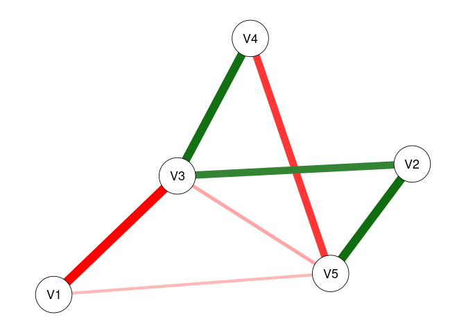
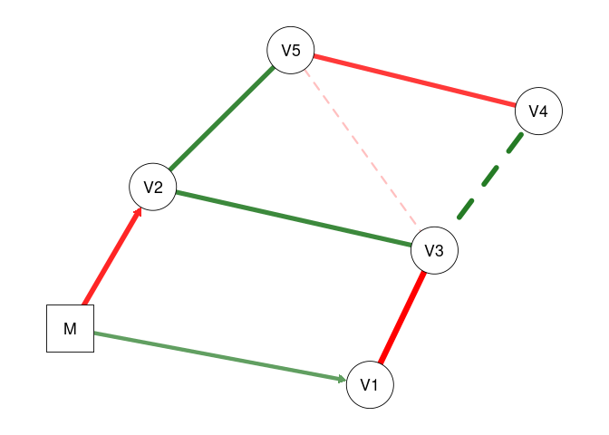

<!-- README.md is generated from README.Rmd. Please edit that file -->

# modnets

<!-- badges: start -->
<!-- badges: end -->

R package designed to afford exploratory and confirmatory estimation of
3 types of moderated networks:

1.  Cross-sectional moderated networks
    -   Involves nodewise estimation of a GGM with higher-order
        interactions
    -   Can accomodate any combination of continuous and binary
        variables.
    -   Nodewise regressions are fit using either OLS or logistic
        regression, depending on variable types.
2.  Idiographic (temporal) moderated networks
    -   Involves generalized least squares (GLS) estimation of
        multivariate time series model, as well as the
        inverse-covariance structure of the residuals.
    -   Currently only works for continuous variables, although
        exogenous moderators can be binary.
    -   Default estimation is seemingly unrelated regressions (SUR) via
        `systemfit`, but OLS is also available (unconstrained SUR
        estimates are equivalent to OLS estimates).
3.  Multi-level moderated networks
    -   Uses one of two methods for estimation.
    -   One is a two-step multilevel model, where fixed/random effects
        are estimated separately from between-subject effects
    -   The other uses a formal multilevel moderated vector
        autoregressive model with `lmer`
    -   Only works for continous variables, although exogenous
        moderators can be binary.

Penalized estimators for each of these models are also available, such
as the LASSO, ridge regression, elastic net, the (overlapping) group
LASSO, and the hierarchical LASSO. Hyperparameter selection will be
performed automatically based on either the AIC, BIC, EBIC, or
cross-validation depending upon user input.

## Installation

You can install the development version of modnets from
[GitHub](https://github.com/tswanson222/modnets) with:

``` r
# install.packages('devtools')
devtools::install_github('tswanson222/modnets')
```

## Usage

``` r
library(modnets)

data <- na.omit(psychTools::msq[, c('hostile', 'lonely', 'nervous', 'sleepy', 'depressed')])

fit <- fitNetwork(data, moderators = 'depressed')

plot(fit, threshold = TRUE)
```


## Package Functions

### Primary functions

-   The primary function used for the first two types of models is:
    `fitNetwork`. There are a variety of arguments and options that can
    be used for, e.g., penalized estimation, model specification, etc.
-   The primary functions used for the third model are: `mlGVAR` and
    `lmerVAR`, depending on which approach you wish to use.

### Model selection

-   For model selection, you can use `varSelect` to employ either
    best-subset selection (via `leaps`), the LASSO, ridge regression, or
    elastic net (via `glmnet`), or the hierarchical LASSO (via
    `glinternet`). These methods support various information criteria as
    well as cross-validation for model selection, and are embedded
    within the `varSelect` function.
-   As a note, all of the model selection procedures in `varSelect`
    operate on a sequential, nodewise basis.
-   Additionally, you can use the `resample` function to use repeated
    subsampling or bootstrapping with the `varSelect` algorithm built
    in.
-   This latter method will take into account the actual model-fit
    values (such as those obtained in the GLS-driven SUR for temporal
    networks)

### Stability & power analyses

-   Currently, these methods are not supported in the multilevel
    setting.
-   For bootstrapping/edge-weight accuracy analysis, you can use the
    `bootNet` function.
-   For case-dropping stability analysis, you can use `bootNet` while
    setting `caseDrop = TRUE`.
-   For power analysis, you can use: `mnetPowerSim` to simulate data
    based on expected network structure(s).

## Examples

### Cross-sectional moderated network

``` r
library(modnets)
# Package is now loaded! 

### ================================================ ###
### ======= SIMULATE MODERATED NETWORK DATA ======== ###
### ================================================ ###
# Can simulate data with no moderators, or with one exogenous moderator
set.seed(123)
x <- simNet(N = 500, p = 5, m = TRUE, m1 = .5, m2 = .2, nCores = TRUE)
#> Time difference of 19.41173 secs
str(x)
#> List of 6
#>  $ data      :'data.frame':  500 obs. of  6 variables:
#>   ..$ V1: num [1:500] -0.791 -0.878 -2.208 -1.049 1.881 ...
#>   ..$ V2: num [1:500] -0.261 -0.783 -0.577 0.917 1.295 ...
#>   ..$ V3: num [1:500] -0.48 0.198 1.072 -0.444 0.985 ...
#>   ..$ V4: num [1:500] 0.1699 0.1052 -0.0452 -1.3112 1.4398 ...
#>   ..$ V5: num [1:500] -2.212 0.1654 1.1137 0.0956 0.7739 ...
#>   ..$ M : num [1:500] -1.344 1.215 -0.325 -0.382 -0.526 ...
#>  $ b1        : num [1:5, 1:5] 0 0 -0.445 0 0 ...
#>   ..- attr(*, "dimnames")=List of 2
#>   .. ..$ : NULL
#>   .. ..$ : NULL
#>  $ b2        : num [1:5, 1:5] 0 0 0 0 0.193 ...
#>   ..- attr(*, "dimnames")=List of 2
#>   .. ..$ : NULL
#>   .. ..$ : NULL
#>  $ intercepts: num [1:5] 0 0 0 0 0
#>  $ m         : num -0.56
#>  $ m1        : num [1:5] 0.233 -0.34 -0.137 0 -0.162
#>  - attr(*, "m2")= num 2
#>  - attr(*, "modType")= chr "none"
#>  - attr(*, "class")= chr [1:2] "list" "ggmSim"
#>  - attr(*, "time")= 'difftime' num 19.4113008975983
#>   ..- attr(*, "units")= chr "secs"
### Contents:
# x$data -------- 100x6 dataset, where 'M' is the moderator
# x$b1 ---------- true regression coefficients, where columns --> rows
# x$b2 ---------- true interaction coefficients, where (M * columns) --> rows
# x$intercepts -- true intercepts; defaults to 0
# x$m ----------- true mean of 'M'
# x$m1 ---------- coefficents for main effects of M on outcomes; default to 0

head(x$data)
#>           V1         V2         V3          V4         V5          M
#> 1 -0.7911134 -0.2614304 -0.4795604  0.16987097 -2.2119732 -1.3441546
#> 2 -0.8783308 -0.7826574  0.1981395  0.10520592  0.1653679  1.2147393
#> 3 -2.2084120 -0.5771286  1.0717002 -0.04523344  1.1137332 -0.3253065
#> 4 -1.0486058  0.9171821 -0.4440444 -1.31115899  0.0955944 -0.3821601
#> 5  1.8806013  1.2949765  0.9848094  1.43979328  0.7739015 -0.5257244
#> 6 -0.9818960  0.5705823  0.7361689 -2.00581568 -0.5349987  0.5393740
print(x$b1)
#>           [,1]      [,2]       [,3]       [,4]       [,5]
#> [1,]  0.000000 0.0000000 -0.4449240  0.0000000  0.0000000
#> [2,]  0.000000 0.0000000  0.2829328  0.0000000  0.3307213
#> [3,] -0.444924 0.2829328  0.0000000  0.2991120  0.0000000
#> [4,]  0.000000 0.0000000  0.2991120  0.0000000 -0.3089766
#> [5,]  0.000000 0.3307213  0.0000000 -0.3089766  0.0000000
print(x$b2)
#>           [,1] [,2]      [,3] [,4]      [,5]
#> [1,] 0.0000000    0 0.0000000    0 0.1931925
#> [2,] 0.0000000    0 0.0000000    0 0.0000000
#> [3,] 0.0000000    0 0.0000000    0 0.2715655
#> [4,] 0.0000000    0 0.0000000    0 0.0000000
#> [5,] 0.1931925    0 0.2715655    0 0.0000000
print(x$intercepts)
#> [1] 0 0 0 0 0
print(x$m)
#> [1] -0.5604756
print(x$m1)
#> [1]  0.2326600 -0.3396775 -0.1365698  0.0000000 -0.1619594
dat0 <- x$data[, -6]
dat1 <- x$data
# First, lets save an object that excludes the moderator (dat0)
# and save a second with the moderator (dat1)


### ================================================ ###
### =============== FITTING MODELS ================= ###
### ================================================ ###
# First, lets fit an unmoderated network, leaving out 'M' entirely
fit0 <- fitNetwork(data = dat0) 

# Next, lets fit a model that only includes 'M' as a covariate
fit1 <- fitNetwork(data = dat1, covariates = 6) 

# Now, lets fit the saturated model where 'M' moderates all edges in the network
fit2 <- fitNetwork(data = dat1, moderators = 6) 


### ================= PLOTTING ===================== ###
plot(fit0)
```


``` r
plot(fit1)
```


``` r
plot(fit2)
```


``` r
# We can plot each of these models to see the resultant undirected network

plot(fit0, threshold = .05)
```



``` r
plot(fit1, threshold = .05)
```


``` r
plot(fit2, threshold = .05)
```


``` r
# Plot only significant edges (p < threshold) of the network.

plot(fit0, threshold = TRUE, predict = TRUE)
```


``` r
plot(fit1, threshold = TRUE, predict = 'R2')
```


``` r
plot(fit2, threshold = TRUE, predict = 'adjR2')
```


``` r
# Using 'threshold = TRUE' is the same as 'threshold = .05'
# 'predict = TRUE' plots R2 values for each regression
# This can also be specified as a string, as shown

plot(fit2, threshold = TRUE, predict = fit0)
```


``` r
# This can also be used to visually compare networks
# Here, the light blue ring around each node shows
# the R2 for 'fit0', while the slightly darker piece 
# shows the increase in R2 that we see with 'fit2'

predictNet(fit2)
#>   Variable    R2 adjR2   MSE  RMSE
#> 1       V1 0.356 0.345 1.003 1.001
#> 2       V2 0.288 0.275 0.938 0.969
#> 3       V3 0.428 0.417 1.075 1.037
#> 4       V4 0.256 0.242 0.968 0.984
#> 5       V5 0.377 0.366 1.089 1.044
predictNet(fit2, fit0)
#>   Variable    R2 adjR2    MSE   RMSE
#> 1       V1 0.164 0.160 -0.243 -0.115
#> 2       V2 0.068 0.061 -0.080 -0.040
#> 3       V3 0.103 0.098 -0.181 -0.084
#> 4       V4 0.008 0.000  0.000  0.000
#> 5       V5 0.103 0.097 -0.167 -0.077
# We can extract these values using this function
# And can take the differences by supplying two networks
# Values for the second model are substracted by those from the first

plot(fit2, mnet = TRUE)
```


``` r
plot(fit2, threshold = TRUE, mnet = TRUE)
```



``` r
# 'mnet = TRUE' plots the exogenous moderator


### ============= VARIABLE SELECTION =============== ###
# These methods demonstrate the two-stage process for variable selection
# In the first stage, we use the data to select the active set of predictors
# In the second stage, we use those predictors to re-fit the models using OLS

### UNMODERATED NETWORKS
vars0 <- varSelect(data = dat0, criterion = 'BIC', method = 'glmnet')
#> =================================================================================================================================
vfit0 <- fitNetwork(data = dat0, type = vars0)
vfit1 <- fitNetwork(data = dat0, type = 'varSelect', criterion = 'BIC')
predictNet(vfit0, vfit1)
#>   Variable R2 adjR2 MSE RMSE
#> 1       V1  0     0   0    0
#> 2       V2  0     0   0    0
#> 3       V3  0     0   0    0
#> 4       V4  0     0   0    0
#> 5       V5  0     0   0    0
# In the first method, we use glmnet to perform variable selection for 
# each of the nodewise models. Then, we can subsequently include this in the
# 'fitNetwork' function. In the second approach, we can simply include everything
# in one command. We see that these produce the exact same models

vfit2 <- fitNetwork(data = dat0, type = 'varSelect', criterion = 'BIC', method = 'subset')
# We can also use best-subsets selection instead of the LASSO

predictNet(vfit2, vfit1)
#>   Variable     R2 adjR2 MSE RMSE
#> 1       V1 -0.002     0   0    0
#> 2       V2 -0.001     0   0    0
#> 3       V3  0.000     0   0    0
#> 4       V4  0.000     0   0    0
#> 5       V5  0.000     0   0    0
# In this case, we see that best-subsets produced lower R2 for three nodes

vfit3 <- fitNetwork(data = dat0, type = 'varSelect', criterion = 'CV', seed = 1)
vfit3.1 <- fitNetwork(data = dat0, type = 'varSelect', criterion = 'CV', seed = 1)
vfit3.2 <- fitNetwork(data = dat0, type = 'varSelect', criterion = 'CV', seed = 99)
# We can also use cross-validation with glmnet (but not best-subsets)

predictNet(vfit3, vfit3.1)
#>   Variable R2 adjR2 MSE RMSE
#> 1       V1  0     0   0    0
#> 2       V2  0     0   0    0
#> 3       V3  0     0   0    0
#> 4       V4  0     0   0    0
#> 5       V5  0     0   0    0
predictNet(vfit3, vfit3.2)
#>   Variable R2 adjR2    MSE   RMSE
#> 1       V1  0 0.000  0.000  0.000
#> 2       V2  0 0.000  0.000  0.000
#> 3       V3  0 0.000  0.000  0.000
#> 4       V4  0 0.002 -0.001 -0.001
#> 5       V5  0 0.000  0.000  0.000
# We see that setting a seed leads to reproducible results


### MODERATED NETWORKS
vars1 <- varSelect(data = dat1, m = 6, criterion = 'BIC', method = 'glinternet')
#> Fitting model 1/5...  Complete! (0.1 secs)
#> Fitting model 2/5...  Complete! (0.15 secs)
#> Fitting model 3/5...  Complete! (0.07 secs)
#> Fitting model 4/5...  Complete! (0.07 secs)
#> Fitting model 5/5...  Complete! (0.07 secs)
#> ####### Total time: 0.47 secs
mfit1 <- fitNetwork(data = dat1, moderators = 6, type = vars1)
mfit2 <- fitNetwork(data = dat1, moderators = 6, type = 'varSelect', criterion = 'BIC')
predictNet(mfit1, mfit2)
#>   Variable R2 adjR2 MSE RMSE
#> 1       V1  0     0   0    0
#> 2       V2  0     0   0    0
#> 3       V3  0     0   0    0
#> 4       V4  0     0   0    0
#> 5       V5  0     0   0    0
# Again, we see that both methods produce the same model
# Creating the 'vars1' object separately can be useful when we wish
# to analyze the results from the variable selection process; plot outputs, obtain coefficients, etc.
# Also, all moderated networks use 'glinternet' as the selection method, and so it does not need to be specified

mfit2 <- fitNetwork(data = dat1, moderators = 6, type = 'varSelect', criterion = 'CV', seed = 1)
# We can use cross-validation with the glinternet algorithm as well


### ============== MODEL COMPARISON ================ ###
# Create a list of models we want to compare
fits <- list(fit0 = fit0, fit1 = fit1, fit2 = fit2, 
             vfit1 = vfit1, vfit2 = vfit2, vfit3 = vfit3,
             mfit1 = mfit1, mfit2 = mfit2)

modTable(fits)
#> $LRT
#>     net0  net1    Chisq Df   pval decision
#> 1   fit0  fit1  45.7154  5 0.0000     fit1
#> 2   fit0  fit2 305.6719 25 0.0000     fit2
#> 3  vfit1  fit0   2.6884  4 0.6113    vfit1
#> 4  vfit2  fit0   4.5791  6 0.5988    vfit2
#> 5  vfit3  fit0   0.0912  2 0.9554    vfit3
#> 6   fit0 mfit1 278.6961  8 0.0000    mfit1
#> 7   fit0 mfit2 297.6596 14 0.0000    mfit2
#> 8   fit1  fit2 259.9565 20 0.0000     fit2
#> 9  vfit1  fit1  48.4038  9 0.0000     fit1
#> 10 vfit2  fit1  50.2945 11 0.0000     fit1
#> 11 vfit3  fit1  45.8066  7 0.0000     fit1
#> 12  fit1 mfit1 232.9807  3 0.0000    mfit1
#> 13  fit1 mfit2 251.9442  9 0.0000    mfit2
#> 14 vfit1  fit2 308.3603 29 0.0000     fit2
#> 15 vfit2  fit2 310.2511 31 0.0000     fit2
#> 16 vfit3  fit2 305.7632 27 0.0000     fit2
#> 17 mfit1  fit2  26.9758 17 0.0584    mfit1
#> 18 mfit2  fit2   8.0123 11 0.7122    mfit2
#> 19 vfit2 vfit1   1.8908  2 0.3885    vfit2
#> 20 vfit1 vfit3   2.5971  2 0.2729    vfit1
#> 21 vfit1 mfit1 281.3844 12 0.0000    mfit1
#> 22 vfit1 mfit2 300.3480 18 0.0000    mfit2
#> 23 vfit2 vfit3   4.4879  4 0.3440    vfit2
#> 24 vfit2 mfit1 283.2752 14 0.0000    mfit1
#> 25 vfit2 mfit2 302.2387 20 0.0000    mfit2
#> 26 vfit3 mfit1 278.7873 10 0.0000    mfit1
#> 27 vfit3 mfit2 297.7508 16 0.0000    mfit2
#> 28 mfit1 mfit2  18.9635  6 0.0042    mfit2
#> 
#> $omnibus
#>              LL df      AIC      BIC LRT
#> mfit2 -3375.147 40 6830.293 7063.255   7
#> mfit1 -3384.628 34 6837.257 7035.274   6
#> fit2  -3371.140 51 6844.281 7141.307   5
#> fit1  -3501.119 31 7064.237 7244.783   4
#> vfit2 -3526.266 20 7092.532 7209.013   3
#> vfit1 -3525.321 22 7094.641 7222.770   2
#> vfit3 -3524.022 24 7096.044 7235.821   1
#> fit0  -3523.976 26 7099.953 7251.378   0
#> 
#> attr(,"alpha")
#> [1] 0.05
# Performs likelihood ratio tests comparing each model with every other

modTable(fits)$omnibus
#>              LL df      AIC      BIC LRT
#> mfit2 -3375.147 40 6830.293 7063.255   7
#> mfit1 -3384.628 34 6837.257 7035.274   6
#> fit2  -3371.140 51 6844.281 7141.307   5
#> fit1  -3501.119 31 7064.237 7244.783   4
#> vfit2 -3526.266 20 7092.532 7209.013   3
#> vfit1 -3525.321 22 7094.641 7222.770   2
#> vfit3 -3524.022 24 7096.044 7235.821   1
#> fit0  -3523.976 26 7099.953 7251.378   0
# This shows us the final results. The 'LRT' column indicates
# the total number of times each model was selected across all tests
# We can see that 'fit2' (the saturated MNM) was selected across all tests
# The second-most selected was 'mfit2', which used glinternet with CV selection

modTable(fits, nodes = TRUE)
#> $nodes
#> $nodes$V1
#>              LL  df      AIC      BIC
#> fit0  -761.9507 495 1535.901 1561.189
#> fit1  -747.5553 494 1509.111 1538.613
#> fit2  -705.0658 490 1432.132 1478.492
#> vfit1 -762.6000 496 1535.200 1556.273
#> vfit2 -763.0727 497 1534.145 1551.004
#> vfit3 -761.9507 495 1535.901 1561.189
#> mfit1 -705.3989 492 1428.798 1466.729
#> mfit2 -705.3989 492 1428.798 1466.729
#> 
#> $nodes$V2
#>              LL  df      AIC      BIC
#> fit0  -711.3200 495 1434.640 1459.928
#> fit1  -695.3118 494 1404.624 1434.126
#> fit2  -688.5300 490 1399.060 1445.421
#> vfit1 -711.3428 496 1432.686 1453.759
#> vfit2 -711.8155 497 1431.631 1448.489
#> vfit3 -711.3428 496 1432.686 1453.759
#> mfit1 -691.2753 495 1394.551 1419.838
#> mfit2 -688.8909 493 1393.782 1427.499
#> 
#> $nodes$V3
#>              LL  df      AIC      BIC
#> fit0  -763.9010 495 1539.802 1565.090
#> fit1  -762.7013 494 1539.403 1568.905
#> fit2  -722.5540 490 1467.108 1513.469
#> vfit1 -763.9010 495 1539.802 1565.090
#> vfit2 -763.9010 495 1539.802 1565.090
#> vfit3 -763.9010 495 1539.802 1565.090
#> mfit1 -722.8390 492 1463.678 1501.609
#> mfit2 -722.5968 491 1465.194 1507.340
#> 
#> $nodes$V4
#>              LL  df      AIC      BIC
#> fit0  -698.9384 495 1409.877 1435.165
#> fit1  -697.3786 494 1408.757 1438.259
#> fit2  -696.3779 490 1414.756 1461.116
#> vfit1 -699.6012 497 1407.202 1424.061
#> vfit2 -699.6012 497 1407.202 1424.061
#> vfit3 -698.9613 496 1407.923 1428.996
#> mfit1 -699.6012 497 1407.202 1424.061
#> mfit2 -696.9550 494 1407.910 1437.412
#> 
#> $nodes$V5
#>              LL  df      AIC      BIC
#> fit0  -763.9703 495 1539.941 1565.228
#> fit1  -763.0314 494 1540.063 1569.565
#> fit2  -725.7126 490 1473.425 1519.786
#> vfit1 -763.9703 495 1539.941 1565.228
#> vfit2 -763.9703 495 1539.941 1565.228
#> vfit3 -763.9703 495 1539.941 1565.228
#> mfit1 -725.7185 491 1471.437 1513.583
#> mfit2 -725.7185 491 1471.437 1513.583
#> 
#> 
#> $LRT
#> $LRT$LL_diff2
#>     net0  net1 |          V1          V2          V3         V4          V5
#> 1   fit0  fit1 |  28.7909084 32.01645736  2.39928093 3.11966506  1.87788115
#> 2   fit0  fit2 | 113.7698293 45.57996088 82.69401357 5.12115797 76.51549051
#> 3  vfit1  fit0 |   1.2985624  0.04561713  0.00000000 1.32544749  0.00000000
#> 4  vfit2  fit0 |   2.2439499  0.99100468  0.00000000 1.32544749  0.00000000
#> 5  vfit3  fit0 |   0.0000000  0.04561713  0.00000000 0.04561713  0.00000000
#> 6   fit0 mfit1 | 113.1036223 40.08939066 82.12400338 1.32544749 76.50361944
#> 7   fit0 mfit2 | 113.1036223 44.85817903 82.60826973 3.96689390 76.50361944
#> 8   fit1  fit2 |  84.9789210 13.56350352 80.29473264 2.00149290 74.63760935
#> 9  vfit1  fit1 |  30.0894708 32.06207449  2.39928093 4.44511256  1.87788115
#> 10 vfit2  fit1 |  31.0348583 33.00746204  2.39928093 4.44511256  1.87788115
#> 11 vfit3  fit1 |  28.7909084 32.06207449  2.39928093 3.16528219  1.87788115
#> 12  fit1 mfit1 |  84.3127139  8.07293330 79.72472245 4.44511256 74.62573829
#> 13  fit1 mfit2 |  84.3127139 12.84172167 80.20898880 0.84722883 74.62573829
#> 14 vfit1  fit2 | 115.0683917 45.62557801 82.69401357 6.44660546 76.51549051
#> 15 vfit2  fit2 | 116.0137793 46.57096556 82.69401357 6.44660546 76.51549051
#> 16 vfit3  fit2 | 113.7698293 45.62557801 82.69401357 5.16677509 76.51549051
#> 17 mfit1  fit2 |   0.6662070  5.49057021  0.57001018 6.44660546  0.01187107
#> 18 mfit2  fit2 |   0.6662070  0.72178184  0.08574384 1.15426407  0.01187107
#> 19 vfit2 vfit1 |   0.9453876  0.94538755  0.00000000 0.00000000  0.00000000
#> 20 vfit1 vfit3 |   1.2985624  0.00000000  0.00000000 1.27983036  0.00000000
#> 21 vfit1 mfit1 | 114.4021847 40.13500779 82.12400338 0.00000000 76.50361944
#> 22 vfit1 mfit2 | 114.4021847 44.90379616 82.60826973 5.29234139 76.50361944
#> 23 vfit2 vfit3 |   2.2439499  0.94538755  0.00000000 1.27983036  0.00000000
#> 24 vfit2 mfit1 | 115.3475722 41.08039534 82.12400338 0.00000000 76.50361944
#> 25 vfit2 mfit2 | 115.3475722 45.84918371 82.60826973 5.29234139 76.50361944
#> 26 vfit3 mfit1 | 113.1036223 40.13500779 82.12400338 1.27983036 76.50361944
#> 27 vfit3 mfit2 | 113.1036223 44.90379616 82.60826973 4.01251102 76.50361944
#> 28 mfit1 mfit2 |   0.0000000  4.76878837  0.48426635 5.29234139  0.00000000
#> 
#> $LRT$Df_diff
#>     net0  net1 | V1 V2 V3 V4 V5
#> 1   fit0  fit1 |  1  1  1  1  1
#> 2   fit0  fit2 |  5  5  5  5  5
#> 3  vfit1  fit0 |  1  1  0  2  0
#> 4  vfit2  fit0 |  2  2  0  2  0
#> 5  vfit3  fit0 |  0  1  0  1  0
#> 6   fit0 mfit1 |  3  0  3  2  4
#> 7   fit0 mfit2 |  3  2  4  1  4
#> 8   fit1  fit2 |  4  4  4  4  4
#> 9  vfit1  fit1 |  2  2  1  3  1
#> 10 vfit2  fit1 |  3  3  1  3  1
#> 11 vfit3  fit1 |  1  2  1  2  1
#> 12  fit1 mfit1 |  2  1  2  3  3
#> 13  fit1 mfit2 |  2  1  3  0  3
#> 14 vfit1  fit2 |  6  6  5  7  5
#> 15 vfit2  fit2 |  7  7  5  7  5
#> 16 vfit3  fit2 |  5  6  5  6  5
#> 17 mfit1  fit2 |  2  5  2  7  1
#> 18 mfit2  fit2 |  2  3  1  4  1
#> 19 vfit2 vfit1 |  1  1  0  0  0
#> 20 vfit1 vfit3 |  1  0  0  1  0
#> 21 vfit1 mfit1 |  4  1  3  0  4
#> 22 vfit1 mfit2 |  4  3  4  3  4
#> 23 vfit2 vfit3 |  2  1  0  1  0
#> 24 vfit2 mfit1 |  5  2  3  0  4
#> 25 vfit2 mfit2 |  5  4  4  3  4
#> 26 vfit3 mfit1 |  3  1  3  1  4
#> 27 vfit3 mfit2 |  3  3  4  2  4
#> 28 mfit1 mfit2 |  0  2  1  3  0
#> 
#> $LRT$pval
#>     net0  net1 |     V1     V2     V3     V4     V5
#> 1   fit0  fit1 | 0.0000 0.0000 0.1214 0.0774 0.1706
#> 2   fit0  fit2 | 0.0000 0.0000 0.0000 0.4013 0.0000
#> 3  vfit1  fit0 | 0.2545 0.8309 1.0000 0.5154 1.0000
#> 4  vfit2  fit0 | 0.3256 0.6093 1.0000 0.5154 1.0000
#> 5  vfit3  fit0 | 1.0000 0.8309 1.0000 0.8309 1.0000
#> 6   fit0 mfit1 | 0.0000 0.0000 0.0000 0.5154 0.0000
#> 7   fit0 mfit2 | 0.0000 0.0000 0.0000 0.0464 0.0000
#> 8   fit1  fit2 | 0.0000 0.0088 0.0000 0.7355 0.0000
#> 9  vfit1  fit1 | 0.0000 0.0000 0.1214 0.2172 0.1706
#> 10 vfit2  fit1 | 0.0000 0.0000 0.1214 0.2172 0.1706
#> 11 vfit3  fit1 | 0.0000 0.0000 0.1214 0.2054 0.1706
#> 12  fit1 mfit1 | 0.0000 0.0045 0.0000 0.2172 0.0000
#> 13  fit1 mfit2 | 0.0000 0.0003 0.0000 0.0000 0.0000
#> 14 vfit1  fit2 | 0.0000 0.0000 0.0000 0.4887 0.0000
#> 15 vfit2  fit2 | 0.0000 0.0000 0.0000 0.4887 0.0000
#> 16 vfit3  fit2 | 0.0000 0.0000 0.0000 0.5226 0.0000
#> 17 mfit1  fit2 | 0.7167 0.3590 0.7520 0.4887 0.9132
#> 18 mfit2  fit2 | 0.7167 0.8681 0.7697 0.8856 0.9132
#> 19 vfit2 vfit1 | 0.3309 0.3309 1.0000 1.0000 1.0000
#> 20 vfit1 vfit3 | 0.2545 1.0000 1.0000 0.2579 1.0000
#> 21 vfit1 mfit1 | 0.0000 0.0000 0.0000 1.0000 0.0000
#> 22 vfit1 mfit2 | 0.0000 0.0000 0.0000 0.1516 0.0000
#> 23 vfit2 vfit3 | 0.3256 0.3309 1.0000 0.2579 1.0000
#> 24 vfit2 mfit1 | 0.0000 0.0000 0.0000 1.0000 0.0000
#> 25 vfit2 mfit2 | 0.0000 0.0000 0.0000 0.1516 0.0000
#> 26 vfit3 mfit1 | 0.0000 0.0000 0.0000 0.2579 0.0000
#> 27 vfit3 mfit2 | 0.0000 0.0000 0.0000 0.1345 0.0000
#> 28 mfit1 mfit2 | 1.0000 0.0921 0.4865 0.1516 1.0000
#> 
#> $LRT$decision
#>     net0  net1 |    V1    V2    V3    V4    V5
#> 1   fit0  fit1 |  fit1  fit1  fit0  fit0  fit0
#> 2   fit0  fit2 |  fit2  fit2  fit2  fit0  fit2
#> 3  vfit1  fit0 | vfit1 vfit1    -  vfit1    - 
#> 4  vfit2  fit0 | vfit2 vfit2    -  vfit2    - 
#> 5  vfit3  fit0 |    -  vfit3    -  vfit3    - 
#> 6   fit0 mfit1 | mfit1 mfit1 mfit1 mfit1 mfit1
#> 7   fit0 mfit2 | mfit2 mfit2 mfit2 mfit2 mfit2
#> 8   fit1  fit2 |  fit2  fit2  fit2  fit1  fit2
#> 9  vfit1  fit1 |  fit1  fit1 vfit1 vfit1 vfit1
#> 10 vfit2  fit1 |  fit1  fit1 vfit2 vfit2 vfit2
#> 11 vfit3  fit1 |  fit1  fit1 vfit3 vfit3 vfit3
#> 12  fit1 mfit1 | mfit1 mfit1 mfit1 mfit1 mfit1
#> 13  fit1 mfit2 | mfit2 mfit2 mfit2 mfit2 mfit2
#> 14 vfit1  fit2 |  fit2  fit2  fit2 vfit1  fit2
#> 15 vfit2  fit2 |  fit2  fit2  fit2 vfit2  fit2
#> 16 vfit3  fit2 |  fit2  fit2  fit2 vfit3  fit2
#> 17 mfit1  fit2 | mfit1 mfit1 mfit1 mfit1 mfit1
#> 18 mfit2  fit2 | mfit2 mfit2 mfit2 mfit2 mfit2
#> 19 vfit2 vfit1 | vfit2 vfit2    -     -     - 
#> 20 vfit1 vfit3 | vfit1    -     -  vfit1    - 
#> 21 vfit1 mfit1 | mfit1 mfit1 mfit1    -  mfit1
#> 22 vfit1 mfit2 | mfit2 mfit2 mfit2 vfit1 mfit2
#> 23 vfit2 vfit3 | vfit2 vfit2    -  vfit2    - 
#> 24 vfit2 mfit1 | mfit1 mfit1 mfit1    -  mfit1
#> 25 vfit2 mfit2 | mfit2 mfit2 mfit2 vfit2 mfit2
#> 26 vfit3 mfit1 | mfit1 mfit1 mfit1 mfit1 mfit1
#> 27 vfit3 mfit2 | mfit2 mfit2 mfit2 vfit3 mfit2
#> 28 mfit1 mfit2 |    -  mfit1 mfit1 mfit1    - 
#> 
#> 
#> $counts
#>       V1 V2 V3 V4 V5
#> fit0   0  0  1  2  1
#> fit1   4  4  0  1  0
#> fit2   5  5  5  0  5
#> vfit1  2  1  1  5  1
#> vfit2  3  3  1  5  1
#> vfit3  0  1  1  4  1
#> mfit1  6  7  7  5  6
#> mfit2  6  6  6  3  6
#> 
#> attr(,"alpha")
#> [1] 0.05
# This does the same thing as above but at the nodewise level
```

More examples to be added soon.

Please contact <trevorswanson222@gmail.com> with any questions.
