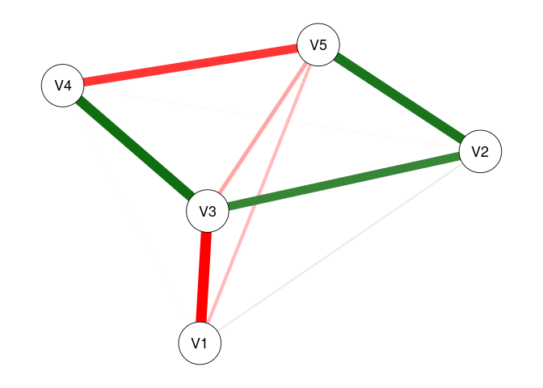
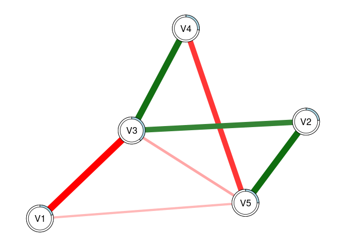
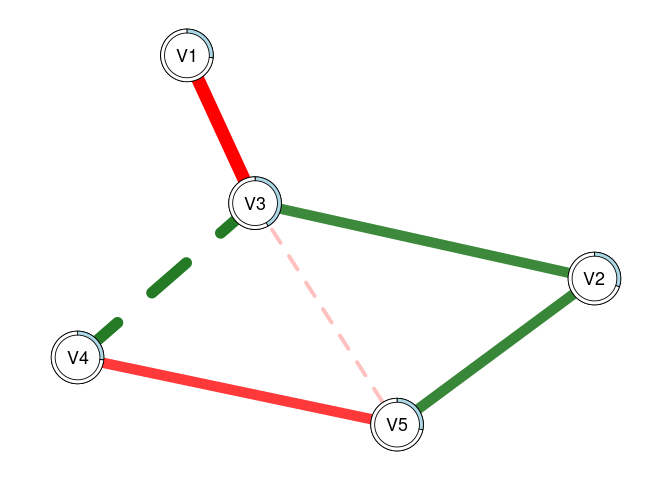

<!-- README.md is generated from README.Rmd. Please edit that file -->

# modnets

<!-- badges: start -->
<!-- badges: end -->

R package designed to afford exploratory and confirmatory estimation of
3 types of moderated networks:

1.  Cross-sectional moderated networks
    -   Involves nodewise estimation of a GGM with higher-order
        interactions
    -   Can accomodate any combination of continuous and binary
        variables.
    -   Nodewise regressions are fit using either OLS or logistic
        regression, depending on variable types.
2.  Idiographic (temporal) moderated networks
    -   Involves generalized least squares (GLS) estimation of
        multivariate time series model, as well as the
        inverse-covariance structure of the residuals.
    -   Currently only works for continuous variables, although
        exogenous moderators can be binary.
    -   Default estimation is seemingly unrelated regressions (SUR) via
        `systemfit`, but OLS is also available (unconstrained SUR
        estimates are equivalent to OLS estimates).
3.  Multi-level moderated networks
    -   Uses one of two methods for estimation.
    -   One is a two-step multilevel model, where fixed/random effects
        are estimated separately from between-subject effects
    -   The other uses a formal multilevel moderated vector
        autoregressive model with `lmer`
    -   Only works for continous variables, although exogenous
        moderators can be binary.

Penalized estimators for each of these models are also available, such
as the LASSO, ridge regression, elastic net, the (overlapping) group
LASSO, and the hierarchical LASSO. Hyperparameter selection will be
performed automatically based on either the AIC, BIC, EBIC, or
cross-validation depending upon user input.

## Installation

You can install the development version of modnets from
[GitHub](https://github.com/tswanson222/modnets) with:

``` r
# install.packages('devtools')
devtools::install_github('tswanson222/modnets')
```

## Usage

``` r
library(modnets)

data <- na.omit(psychTools::msq[, c('hostile', 'lonely', 'nervous', 'sleepy', 'depressed')])

fit <- fitNetwork(data, moderators = 'depressed')

plot(fit, threshold = TRUE)
```


## Package Functions

### Primary functions

-   The primary function used for the first two types of models is:
    `fitNetwork`. There are a variety of arguments and options that can
    be used for, e.g., penalized estimation, model specification, etc.
-   The primary functions used for the third model are: `mlGVAR` and
    `lmerVAR`, depending on which approach you wish to use.

### Model selection

-   For model selection, you can use `varSelect` to employ either
    best-subset selection (via `leaps`), the LASSO, ridge regression, or
    elastic net (via `glmnet`), or the hierarchical LASSO (via
    `glinternet`). These methods support various information criteria as
    well as cross-validation for model selection, and are embedded
    within the `varSelect` function.
-   As a note, all of the model selection procedures in `varSelect`
    operate on a sequential, nodewise basis.
-   Additionally, you can use the `resample` function to use repeated
    subsampling or bootstrapping with the `varSelect` algorithm built
    in.
-   This latter method will take into account the actual model-fit
    values (such as those obtained in the GLS-driven SUR for temporal
    networks)

### Stability & power analyses

-   Currently, these methods are not supported in the multilevel
    setting.
-   For bootstrapping/edge-weight accuracy analysis, you can use the
    `bootNet` function.
-   For case-dropping stability analysis, you can use `bootNet` while
    setting `caseDrop = TRUE`.
-   For power analysis, you can use: `mnetPowerSim` to simulate data
    based on expected network structure(s).

## Examples

### Cross-sectional moderated network

``` r
library(modnets)
# Package is now loaded! 

### ================================================ ###
### ======= SIMULATE MODERATED NETWORK DATA ======== ###
### ================================================ ###
# Can simulate data with no moderators, or with one exogenous moderator
set.seed(999)
x <- simNet(N = 100, p = 5, m = TRUE, sparsity = .5)
#>   |                                                                              |                                                                      |   0%  |                                                                              |=                                                                     |   1%  |                                                                              |=                                                                     |   2%  |                                                                              |==                                                                    |   3%  |                                                                              |===                                                                   |   4%  |                                                                              |====                                                                  |   5%  |                                                                              |====                                                                  |   6%  |                                                                              |=====                                                                 |   7%  |                                                                              |======                                                                |   8%  |                                                                              |======                                                                |   9%  |                                                                              |=======                                                               |  10%  |                                                                              |========                                                              |  11%  |                                                                              |========                                                              |  12%  |                                                                              |=========                                                             |  13%  |                                                                              |==========                                                            |  14%  |                                                                              |==========                                                            |  15%  |                                                                              |===========                                                           |  16%  |                                                                              |============                                                          |  17%  |                                                                              |=============                                                         |  18%  |                                                                              |=============                                                         |  19%  |                                                                              |==============                                                        |  20%  |                                                                              |===============                                                       |  21%  |                                                                              |===============                                                       |  22%  |                                                                              |================                                                      |  23%  |                                                                              |=================                                                     |  24%  |                                                                              |==================                                                    |  25%  |                                                                              |==================                                                    |  26%  |                                                                              |===================                                                   |  27%  |                                                                              |====================                                                  |  28%  |                                                                              |====================                                                  |  29%  |                                                                              |=====================                                                 |  30%  |                                                                              |======================                                                |  31%  |                                                                              |======================                                                |  32%  |                                                                              |=======================                                               |  33%  |                                                                              |========================                                              |  34%  |                                                                              |========================                                              |  35%  |                                                                              |=========================                                             |  36%  |                                                                              |==========================                                            |  37%  |                                                                              |===========================                                           |  38%  |                                                                              |===========================                                           |  39%  |                                                                              |============================                                          |  40%  |                                                                              |=============================                                         |  41%  |                                                                              |=============================                                         |  42%  |                                                                              |==============================                                        |  43%  |                                                                              |===============================                                       |  44%  |                                                                              |================================                                      |  45%  |                                                                              |================================                                      |  46%  |                                                                              |=================================                                     |  47%  |                                                                              |==================================                                    |  48%  |                                                                              |==================================                                    |  49%  |                                                                              |===================================                                   |  50%  |                                                                              |====================================                                  |  51%  |                                                                              |====================================                                  |  52%  |                                                                              |=====================================                                 |  53%  |                                                                              |======================================                                |  54%  |                                                                              |======================================                                |  55%  |                                                                              |=======================================                               |  56%  |                                                                              |========================================                              |  57%  |                                                                              |=========================================                             |  58%  |                                                                              |=========================================                             |  59%  |                                                                              |==========================================                            |  60%  |                                                                              |===========================================                           |  61%  |                                                                              |===========================================                           |  62%  |                                                                              |============================================                          |  63%  |                                                                              |=============================================                         |  64%  |                                                                              |==============================================                        |  65%  |                                                                              |==============================================                        |  66%  |                                                                              |===============================================                       |  67%  |                                                                              |================================================                      |  68%  |                                                                              |================================================                      |  69%  |                                                                              |=================================================                     |  70%  |                                                                              |==================================================                    |  71%  |                                                                              |==================================================                    |  72%  |                                                                              |===================================================                   |  73%  |                                                                              |====================================================                  |  74%  |                                                                              |====================================================                  |  75%  |                                                                              |=====================================================                 |  76%  |                                                                              |======================================================                |  77%  |                                                                              |=======================================================               |  78%  |                                                                              |=======================================================               |  79%  |                                                                              |========================================================              |  80%  |                                                                              |=========================================================             |  81%  |                                                                              |=========================================================             |  82%  |                                                                              |==========================================================            |  83%  |                                                                              |===========================================================           |  84%  |                                                                              |============================================================          |  85%  |                                                                              |============================================================          |  86%  |                                                                              |=============================================================         |  87%  |                                                                              |==============================================================        |  88%  |                                                                              |==============================================================        |  89%  |                                                                              |===============================================================       |  90%  |                                                                              |================================================================      |  91%  |                                                                              |================================================================      |  92%  |                                                                              |=================================================================     |  93%  |                                                                              |==================================================================    |  94%  |                                                                              |==================================================================    |  95%  |                                                                              |===================================================================   |  96%  |                                                                              |====================================================================  |  97%  |                                                                              |===================================================================== |  98%  |                                                                              |===================================================================== |  99%  |                                                                              |======================================================================| 100%
#> Time difference of 4.240793 secs
str(x)
#> List of 6
#>  $ data      :'data.frame':  100 obs. of  6 variables:
#>   ..$ V1: num [1:100] 1.427 0.43 0.264 0.486 -1.82 ...
#>   ..$ V2: num [1:100] -0.2765 -1.0276 0.0608 0.3203 0.4546 ...
#>   ..$ V3: num [1:100] -1.606 1.193 -1.963 2.169 0.558 ...
#>   ..$ V4: num [1:100] 0.532 -0.622 0.711 0.37 0.72 ...
#>   ..$ V5: num [1:100] 0.961 -1.49 1.296 -0.667 -1.136 ...
#>   ..$ M : num [1:100] -2.138 0.654 -0.249 0.633 -0.237 ...
#>  $ b1        : num [1:5, 1:5] 0 -0.427 0.178 0 -0.33 ...
#>   ..- attr(*, "dimnames")=List of 2
#>   .. ..$ : NULL
#>   .. ..$ : NULL
#>  $ b2        : num [1:5, 1:5] 0 0 0 0 0 ...
#>   ..- attr(*, "dimnames")=List of 2
#>   .. ..$ : NULL
#>   .. ..$ : NULL
#>  $ intercepts: num [1:5] 0 0 0 0 0
#>  $ m         : num -0.282
#>  $ m1        : num [1:5] 0 0 0 0 0
#>  - attr(*, "m2")= num 1
#>  - attr(*, "modType")= chr "none"
#>  - attr(*, "class")= chr [1:2] "list" "ggmSim"
#>  - attr(*, "time")= 'difftime' num 4.24058747291565
#>   ..- attr(*, "units")= chr "secs"
### Contents:
# x$data -------- 100x6 dataset, where 'M' is the moderator
# x$b1 ---------- true regression coefficients, where columns --> rows
# x$b2 ---------- true interaction coefficients, where (M * columns) --> rows
# x$intercepts -- true intercepts; defaults to 0
# x$m ----------- true mean of 'M'
# x$m1 ---------- coefficents for main effects of M on outcomes; default to 0

head(x$data)
#>           V1          V2         V3         V4         V5          M
#> 1  1.4266364 -0.27649392 -1.6060591  0.5317459  0.9614378 -2.1375788
#> 2  0.4304200 -1.02757902  1.1933078 -0.6216136 -1.4895792  0.6536718
#> 3  0.2644074  0.06079634 -1.9634566  0.7105405  1.2961307 -0.2493775
#> 4  0.4858382  0.32034709  2.1690600  0.3700465 -0.6670597  0.6329320
#> 5 -1.8195020  0.45464211  0.5575884  0.7197106 -1.1358908 -0.2372885
#> 6 -1.8213803  2.53732046  0.1804270  1.0596605  1.7579139  0.5425361
print(x$b1)
#>            [,1]       [,2]      [,3]    [,4]       [,5]
#> [1,]  0.0000000 -0.4269586  0.178164 0.00000 -0.3304581
#> [2,] -0.4269586  0.0000000  0.000000 0.00000  0.0000000
#> [3,]  0.1781640  0.0000000  0.000000 0.44572 -0.2853660
#> [4,]  0.0000000  0.0000000  0.445720 0.00000  0.0000000
#> [5,] -0.3304581  0.0000000 -0.285366 0.00000  0.0000000
print(x$b2)
#>      [,1]       [,2] [,3]       [,4] [,5]
#> [1,]    0  0.0000000    0  0.0000000    0
#> [2,]    0  0.0000000    0 -0.1945365    0
#> [3,]    0  0.0000000    0  0.0000000    0
#> [4,]    0 -0.1945365    0  0.0000000    0
#> [5,]    0  0.0000000    0  0.0000000    0
print(x$intercepts)
#> [1] 0 0 0 0 0
print(x$m)
#> [1] -0.2817402
print(x$m1)
#> [1] 0 0 0 0 0
dat0 <- x$data[, -6]
dat1 <- x$data
# First, lets save an object that excludes the moderator (dat0)
# and save a second with the moderator (dat1)


### ================================================ ###
### =============== FITTING MODELS ================= ###
### ================================================ ###
# First, lets fit an unmoderated network, leaving out 'M' entirely
fit0 <- fitNetwork(data = dat0) 

# Next, lets fit a model that only includes 'M' as a covariate
fit1 <- fitNetwork(data = dat1, covariates = 6) 

# Now, lets fit the saturated model where 'M' moderates all edges in the network
fit2 <- fitNetwork(data = dat1, moderators = 6) 


### ================= PLOTTING ===================== ###
plot(fit0)
```


``` r
plot(fit1)
```



``` r
plot(fit2)
```


``` r
# We can plot each of these models to see the resultant undirected network

plot(fit0, threshold = .05)
```


``` r
plot(fit1, threshold = .05)
```


``` r
plot(fit2, threshold = .05)
```


``` r
# Plot only significant edges (p < threshold) of the network.

plot(fit0, threshold = TRUE, predict = TRUE)
```



``` r
plot(fit1, threshold = TRUE, predict = 'R2')
```


``` r
plot(fit2, threshold = TRUE, predict = 'adjR2')
```



``` r
# Using 'threshold = TRUE' is the same as 'threshold = .05'
# 'predict = TRUE' plots R2 values for each regression
# This can also be specified as a string, as shown

plot(fit2, threshold = TRUE, predict = fit0)
```


``` r
# This can also be used to visually compare networks
# Here, the light blue ring around each node shows
# the R2 for 'fit0', while the slightly darker piece 
# shows the increase in R2 that we see with 'fit2'

predictNet(fit2)
#>   Variable    R2 adjR2   MSE  RMSE
#> 1       V1 0.372 0.309 1.182 1.087
#> 2       V2 0.276 0.204 1.046 1.023
#> 3       V3 0.386 0.325 1.084 1.041
#> 4       V4 0.228 0.150 1.122 1.059
#> 5       V5 0.262 0.188 0.917 0.958
predictNet(fit2, fit1)
#>   Variable    R2  adjR2   MSE  RMSE
#> 1       V1 0.007 -0.022 0.038 0.017
#> 2       V2 0.010 -0.023 0.030 0.015
#> 3       V3 0.009 -0.019 0.030 0.014
#> 4       V4 0.015 -0.021 0.026 0.012
#> 5       V5 0.011 -0.023 0.027 0.015
# We can extract these values using this function
# And can take the differences by supplying two networks
# Values for the second model are substracted by those from the first

plot(fit2, mnet = TRUE)
```


``` r
plot(fit2, threshold = TRUE, mnet = TRUE)
```


``` r
# 'mnet = TRUE' plots the exogenous moderator


### ============= VARIABLE SELECTION =============== ###
# These methods demonstrate the two-stage process for variable selection
# In the first stage, we use the data to select the active set of predictors
# In the second stage, we use those predictors to re-fit the models using OLS

### UNMODERATED NETWORKS
vars0 <- varSelect(data = dat0, criterion = 'BIC', method = 'glmnet')
#> =================================================================================================================================
vfit0 <- fitNetwork(data = dat0, type = vars0)
vfit1 <- fitNetwork(data = dat0, type = 'varSelect', criterion = 'BIC')
predictNet(vfit0, vfit1)
#>   Variable R2 adjR2 MSE RMSE
#> 1       V1  0     0   0    0
#> 2       V2  0     0   0    0
#> 3       V3  0     0   0    0
#> 4       V4  0     0   0    0
#> 5       V5  0     0   0    0
# In the first method, we use glmnet to perform variable selection for 
# each of the nodewise models. Then, we can subsequently include this in the
# 'fitNetwork' function. In the second approach, we can simply include everything
# in one command. We see that these produce the exact same models

vfit2 <- fitNetwork(data = dat0, type = 'varSelect', criterion = 'BIC', method = 'subset')
# We can also use best-subsets selection instead of the LASSO

predictNet(vfit2, vfit1)
#>   Variable     R2  adjR2   MSE  RMSE
#> 1       V1 -0.019 -0.013 0.022 0.011
#> 2       V2  0.000  0.000 0.000 0.000
#> 3       V3  0.000  0.000 0.000 0.000
#> 4       V4  0.000  0.000 0.000 0.000
#> 5       V5  0.000  0.000 0.000 0.000
# In this case, we see that best-subsets produced lower R2 for three nodes

vfit3 <- fitNetwork(data = dat0, type = 'varSelect', criterion = 'CV', seed = 1)
vfit3.1 <- fitNetwork(data = dat0, type = 'varSelect', criterion = 'CV', seed = 1)
vfit3.2 <- fitNetwork(data = dat0, type = 'varSelect', criterion = 'CV', seed = 99)
# We can also use cross-validation with glmnet (but not best-subsets)

predictNet(vfit3, vfit3.1)
#>   Variable R2 adjR2 MSE RMSE
#> 1       V1  0     0   0    0
#> 2       V2  0     0   0    0
#> 3       V3  0     0   0    0
#> 4       V4  0     0   0    0
#> 5       V5  0     0   0    0
predictNet(vfit3, vfit3.2)
#>   Variable    R2 adjR2    MSE RMSE
#> 1       V1 0.000 0.000  0.000    0
#> 2       V2 0.024 0.001 -0.001    0
#> 3       V3 0.000 0.000  0.000    0
#> 4       V4 0.000 0.000  0.000    0
#> 5       V5 0.000 0.000  0.000    0
# We see that setting a seed leads to reproducible results


### MODERATED NETWORKS
vars1 <- varSelect(data = dat1, m = 6, criterion = 'BIC', method = 'glinternet')
#> Fitting model 1/5...  Complete! (0.05 secs)
#> Fitting model 2/5...  Complete! (0.04 secs)
#> Fitting model 3/5...  Complete! (0.04 secs)
#> Fitting model 4/5...  Complete! (0.06 secs)
#> Fitting model 5/5...  Complete! (0.05 secs)
#> ####### Total time: 0.23 secs
mfit1 <- fitNetwork(data = dat1, moderators = 6, type = vars1)
mfit2 <- fitNetwork(data = dat1, moderators = 6, type = 'varSelect', criterion = 'BIC')
predictNet(mfit1, mfit2)
#>   Variable R2 adjR2 MSE RMSE
#> 1       V1  0     0   0    0
#> 2       V2  0     0   0    0
#> 3       V3  0     0   0    0
#> 4       V4  0     0   0    0
#> 5       V5  0     0   0    0
# Again, we see that both methods produce the same model
# Creating the 'vars1' object separately can be useful when we wish
# to analyze the results from the variable selection process; plot outputs, obtain coefficients, etc.
# Also, all moderated networks use 'glinternet' as the selection method, and so it does not need to be specified

mfit2 <- fitNetwork(data = dat1, moderators = 6, type = 'varSelect', criterion = 'CV', seed = 1)
# We can use cross-validation with the glinternet algorithm as well


### ============== MODEL COMPARISON ================ ###
# Create a list of models we want to compare
fits <- list(fit0 = fit0, fit1 = fit1, fit2 = fit2, 
             vfit1 = vfit1, vfit2 = vfit2, vfit3 = vfit3,
             mfit1 = mfit1, mfit2 = mfit2)

modTable(fits)
#> $LRT
#>     net0  net1   Chisq Df   pval decision
#> 1   fit0  fit1  2.6102  5 0.7598     fit0
#> 2   fit0  fit2  6.0483 25 1.0000     fit0
#> 3  vfit1  fit0 11.1571 10 0.3454    vfit1
#> 4  vfit2  fit0 17.2131 11 0.1017    vfit2
#> 5  vfit3  fit0  1.5180  4 0.8235    vfit3
#> 6  mfit1  fit0 11.1571 10 0.3454    mfit1
#> 7  mfit2  fit0  4.5245  3 0.2101    mfit2
#> 8   fit1  fit2  3.4381 20 1.0000     fit1
#> 9  vfit1  fit1 13.7673 15 0.5432    vfit1
#> 10 vfit2  fit1 19.8233 16 0.2283    vfit2
#> 11 vfit3  fit1  4.1282  9 0.9028    vfit3
#> 12 mfit1  fit1 13.7673 15 0.5432    mfit1
#> 13 mfit2  fit1  7.1347  8 0.5222    mfit2
#> 14 vfit1  fit2 17.2054 35 0.9950    vfit1
#> 15 vfit2  fit2 23.2614 36 0.9501    vfit2
#> 16 vfit3  fit2  7.5663 29 1.0000    vfit3
#> 17 mfit1  fit2 17.2054 35 0.9950    mfit1
#> 18 mfit2  fit2 10.5728 28 0.9988    mfit2
#> 19 vfit2 vfit1  6.0561  1 0.0139    vfit1
#> 20 vfit1 vfit3  9.6391  6 0.1407    vfit1
#> 21 vfit1 mfit1  0.0000  0 1.0000       - 
#> 22 vfit1 mfit2  6.6326  7 0.4681    vfit1
#> 23 vfit2 vfit3 15.6952  7 0.0281    vfit3
#> 24 vfit2 mfit1  6.0561  1 0.0139    mfit1
#> 25 vfit2 mfit2 12.6886  8 0.1230    vfit2
#> 26 mfit1 vfit3  9.6391  6 0.1407    mfit1
#> 27 vfit3 mfit2  3.0065  1 0.0829    vfit3
#> 28 mfit1 mfit2  6.6326  7 0.4681    mfit1
#> 
#> $omnibus
#>              LL df      AIC      BIC LRT
#> vfit1 -669.4733 16 1370.947 1438.380   6
#> mfit1 -669.4733 16 1370.947 1438.380   6
#> vfit3 -664.6538 22 1373.308 1466.029   5
#> vfit2 -672.5014 15 1375.003 1438.222   4
#> mfit2 -666.1571 23 1378.314 1475.250   3
#> fit0  -663.8948 26 1379.790 1489.369   2
#> fit1  -662.5897 31 1387.179 1517.832   1
#> fit2  -660.8707 51 1423.741 1638.686   0
#> 
#> attr(,"alpha")
#> [1] 0.05
# Performs likelihood ratio tests comparing each model with every other

modTable(fits)$omnibus
#>              LL df      AIC      BIC LRT
#> vfit1 -669.4733 16 1370.947 1438.380   6
#> mfit1 -669.4733 16 1370.947 1438.380   6
#> vfit3 -664.6538 22 1373.308 1466.029   5
#> vfit2 -672.5014 15 1375.003 1438.222   4
#> mfit2 -666.1571 23 1378.314 1475.250   3
#> fit0  -663.8948 26 1379.790 1489.369   2
#> fit1  -662.5897 31 1387.179 1517.832   1
#> fit2  -660.8707 51 1423.741 1638.686   0
# This shows us the final results. The 'LRT' column indicates
# the total number of times each model was selected across all tests
# We can see that 'fit2' (the saturated MNM) was selected across all tests
# The second-most selected was 'mfit2', which used glinternet with CV selection

modTable(fits, nodes = TRUE)
#> $nodes
#> $nodes$V1
#>              LL df      AIC      BIC
#> fit0  -145.5594 95 303.1188 318.7499
#> fit1  -145.5384 94 305.0767 323.3129
#> fit2  -145.0062 90 312.0124 340.6692
#> vfit1 -145.7723 96 301.5447 314.5705
#> vfit2 -147.2870 97 302.5739 312.9946
#> vfit3 -145.7723 96 301.5447 314.5705
#> mfit1 -145.7723 96 301.5447 314.5705
#> mfit2 -145.7723 96 301.5447 314.5705
#> 
#> $nodes$V2
#>              LL df      AIC      BIC
#> fit0  -139.6041 95 291.2081 306.8392
#> fit1  -139.5698 94 293.1395 311.3757
#> fit2  -138.8697 90 299.7393 328.3962
#> vfit1 -141.2114 98 288.4228 296.2383
#> vfit2 -141.2114 98 288.4228 296.2383
#> vfit3 -139.6041 95 291.2081 306.8392
#> mfit1 -141.2114 98 288.4228 296.2383
#> mfit2 -141.2114 98 288.4228 296.2383
#> 
#> $nodes$V3
#>              LL df      AIC      BIC
#> fit0  -141.4430 95 294.8861 310.5171
#> fit1  -141.4251 94 296.8501 315.0863
#> fit2  -140.6525 90 303.3050 331.9619
#> vfit1 -142.6744 96 295.3488 308.3746
#> vfit2 -142.6744 96 295.3488 308.3746
#> vfit3 -141.4430 95 294.8861 310.5171
#> mfit1 -142.6744 96 295.3488 308.3746
#> mfit2 -140.8889 93 297.7777 318.6191
#> 
#> $nodes$V4
#>              LL df      AIC      BIC
#> fit0  -144.6933 95 301.3867 317.0177
#> fit1  -143.3681 94 300.7363 318.9725
#> fit2  -142.4030 90 306.8060 335.4629
#> vfit1 -145.6492 98 297.2985 305.1140
#> vfit2 -145.6492 98 297.2985 305.1140
#> vfit3 -145.1504 97 298.3007 308.7214
#> mfit1 -145.6492 98 297.2985 305.1140
#> mfit2 -143.0783 95 298.1566 313.7876
#> 
#> $nodes$V5
#>              LL df      AIC      BIC
#> fit0  -132.9813 95 277.9627 293.5937
#> fit1  -132.9813 94 279.9626 298.1988
#> fit2  -132.2881 90 286.5763 315.2332
#> vfit1 -133.5129 97 275.0257 285.4464
#> vfit2 -133.5129 97 275.0257 285.4464
#> vfit3 -133.1479 96 276.2958 289.3217
#> mfit1 -133.5129 97 275.0257 285.4464
#> mfit2 -133.1479 96 276.2958 289.3217
#> 
#> 
#> $LRT
#> $LRT$LL_diff2
#>     net0  net1 |         V1         V2         V3        V4            V5
#> 1   fit0  fit1 | 0.04209562 0.06861117 0.03595858 2.6503821 0.00002213537
#> 2   fit0  fit2 | 1.10646538 1.46878523 1.58103869 4.5806730 1.38638221750
#> 3  vfit1  fit0 | 0.42583113 3.21463557 2.46271707 1.9118043 1.06306683185
#> 4  vfit2  fit0 | 3.45508902 3.21463557 2.46271707 1.9118043 1.06306683185
#> 5  vfit3  fit0 | 0.42583113 0.00000000 0.00000000 0.9140289 0.33315445215
#> 6  mfit1  fit0 | 0.42583113 3.21463557 2.46271707 1.9118043 1.06306683185
#> 7  mfit2  fit0 | 0.42583113 3.21463557 1.10833993 3.2300798 0.33315445215
#> 8   fit1  fit2 | 1.06436975 1.40017406 1.54508011 1.9302909 1.38636008213
#> 9  vfit1  fit1 | 0.46792675 3.28324674 2.49867565 4.5621864 1.06308896722
#> 10 vfit2  fit1 | 3.49718464 3.28324674 2.49867565 4.5621864 1.06308896722
#> 11 vfit3  fit1 | 0.46792675 0.06861117 0.03595858 3.5644110 0.33317658751
#> 12 mfit1  fit1 | 0.46792675 3.28324674 2.49867565 4.5621864 1.06308896722
#> 13 mfit2  fit1 | 0.46792675 3.28324674 1.07238135 0.5796977 0.33317658751
#> 14 vfit1  fit2 | 1.53229651 4.68342080 4.04375576 6.4924774 2.44944904935
#> 15 vfit2  fit2 | 4.56155440 4.68342080 4.04375576 6.4924774 2.44944904935
#> 16 vfit3  fit2 | 1.53229651 1.46878523 1.58103869 5.4947019 1.71953666964
#> 17 mfit1  fit2 | 1.53229651 4.68342080 4.04375576 6.4924774 2.44944904935
#> 18 mfit2  fit2 | 1.53229651 4.68342080 0.47269876 1.3505933 1.71953666964
#> 19 vfit2 vfit1 | 3.02925789 0.00000000 0.00000000 0.0000000 0.00000000000
#> 20 vfit1 vfit3 | 0.00000000 3.21463557 2.46271707 0.9977754 0.72991237970
#> 21 vfit1 mfit1 | 0.00000000 0.00000000 0.00000000 0.0000000 0.00000000000
#> 22 vfit1 mfit2 | 0.00000000 0.00000000 3.57105699 5.1418841 0.72991237970
#> 23 vfit2 vfit3 | 3.02925789 3.21463557 2.46271707 0.9977754 0.72991237970
#> 24 vfit2 mfit1 | 3.02925789 0.00000000 0.00000000 0.0000000 0.00000000000
#> 25 vfit2 mfit2 | 3.02925789 0.00000000 3.57105699 5.1418841 0.72991237970
#> 26 mfit1 vfit3 | 0.00000000 3.21463557 2.46271707 0.9977754 0.72991237970
#> 27 vfit3 mfit2 | 0.00000000 3.21463557 1.10833993 4.1441087 0.00000000000
#> 28 mfit1 mfit2 | 0.00000000 0.00000000 3.57105699 5.1418841 0.72991237970
#> 
#> $LRT$Df_diff
#>     net0  net1 | V1 V2 V3 V4 V5
#> 1   fit0  fit1 |  1  1  1  1  1
#> 2   fit0  fit2 |  5  5  5  5  5
#> 3  vfit1  fit0 |  1  3  1  3  2
#> 4  vfit2  fit0 |  2  3  1  3  2
#> 5  vfit3  fit0 |  1  0  0  2  1
#> 6  mfit1  fit0 |  1  3  1  3  2
#> 7  mfit2  fit0 |  1  3  2  0  1
#> 8   fit1  fit2 |  4  4  4  4  4
#> 9  vfit1  fit1 |  2  4  2  4  3
#> 10 vfit2  fit1 |  3  4  2  4  3
#> 11 vfit3  fit1 |  2  1  1  3  2
#> 12 mfit1  fit1 |  2  4  2  4  3
#> 13 mfit2  fit1 |  2  4  1  1  2
#> 14 vfit1  fit2 |  6  8  6  8  7
#> 15 vfit2  fit2 |  7  8  6  8  7
#> 16 vfit3  fit2 |  6  5  5  7  6
#> 17 mfit1  fit2 |  6  8  6  8  7
#> 18 mfit2  fit2 |  6  8  3  5  6
#> 19 vfit2 vfit1 |  1  0  0  0  0
#> 20 vfit1 vfit3 |  0  3  1  1  1
#> 21 vfit1 mfit1 |  0  0  0  0  0
#> 22 vfit1 mfit2 |  0  0  3  3  1
#> 23 vfit2 vfit3 |  1  3  1  1  1
#> 24 vfit2 mfit1 |  1  0  0  0  0
#> 25 vfit2 mfit2 |  1  0  3  3  1
#> 26 mfit1 vfit3 |  0  3  1  1  1
#> 27 vfit3 mfit2 |  0  3  2  2  0
#> 28 mfit1 mfit2 |  0  0  3  3  1
#> 
#> $LRT$pval
#>     net0  net1 |     V1     V2     V3     V4     V5
#> 1   fit0  fit1 | 0.8374 0.7934 0.8496 0.1035 0.9962
#> 2   fit0  fit2 | 0.9535 0.9166 0.9035 0.4692 0.9258
#> 3  vfit1  fit0 | 0.5140 0.3597 0.1166 0.5909 0.5877
#> 4  vfit2  fit0 | 0.1777 0.3597 0.1166 0.5909 0.5877
#> 5  vfit3  fit0 | 0.5140 1.0000 1.0000 0.6332 0.5638
#> 6  mfit1  fit0 | 0.5140 0.3597 0.1166 0.5909 0.5877
#> 7  mfit2  fit0 | 0.5140 0.3597 0.5745 0.0000 0.5638
#> 8   fit1  fit2 | 0.8999 0.8442 0.8186 0.7486 0.8466
#> 9  vfit1  fit1 | 0.7914 0.5116 0.2867 0.3352 0.7860
#> 10 vfit2  fit1 | 0.3211 0.5116 0.2867 0.3352 0.7860
#> 11 vfit3  fit1 | 0.7914 0.7934 0.8496 0.3125 0.8465
#> 12 mfit1  fit1 | 0.7914 0.5116 0.2867 0.3352 0.7860
#> 13 mfit2  fit1 | 0.7914 0.5116 0.3004 0.4464 0.8465
#> 14 vfit1  fit2 | 0.9573 0.7908 0.6708 0.5922 0.9309
#> 15 vfit2  fit2 | 0.7133 0.7908 0.6708 0.5922 0.9309
#> 16 vfit3  fit2 | 0.9573 0.9166 0.9035 0.5998 0.9436
#> 17 mfit1  fit2 | 0.9573 0.7908 0.6708 0.5922 0.9309
#> 18 mfit2  fit2 | 0.9573 0.7908 0.9248 0.9296 0.9436
#> 19 vfit2 vfit1 | 0.0818 1.0000 1.0000 1.0000 1.0000
#> 20 vfit1 vfit3 | 1.0000 0.3597 0.1166 0.3178 0.3929
#> 21 vfit1 mfit1 | 1.0000 1.0000 1.0000 1.0000 1.0000
#> 22 vfit1 mfit2 | 1.0000 1.0000 0.3117 0.1617 0.3929
#> 23 vfit2 vfit3 | 0.0818 0.3597 0.1166 0.3178 0.3929
#> 24 vfit2 mfit1 | 0.0818 1.0000 1.0000 1.0000 1.0000
#> 25 vfit2 mfit2 | 0.0818 1.0000 0.3117 0.1617 0.3929
#> 26 mfit1 vfit3 | 1.0000 0.3597 0.1166 0.3178 0.3929
#> 27 vfit3 mfit2 | 1.0000 0.3597 0.5745 0.1259 1.0000
#> 28 mfit1 mfit2 | 1.0000 1.0000 0.3117 0.1617 0.3929
#> 
#> $LRT$decision
#>     net0  net1 |    V1    V2    V3    V4    V5
#> 1   fit0  fit1 |  fit0  fit0  fit0  fit0  fit0
#> 2   fit0  fit2 |  fit0  fit0  fit0  fit0  fit0
#> 3  vfit1  fit0 | vfit1 vfit1 vfit1 vfit1 vfit1
#> 4  vfit2  fit0 | vfit2 vfit2 vfit2 vfit2 vfit2
#> 5  vfit3  fit0 | vfit3    -     -  vfit3 vfit3
#> 6  mfit1  fit0 | mfit1 mfit1 mfit1 mfit1 mfit1
#> 7  mfit2  fit0 | mfit2 mfit2  fit0 mfit2 mfit2
#> 8   fit1  fit2 |  fit1  fit1  fit1  fit1  fit1
#> 9  vfit1  fit1 | vfit1 vfit1 vfit1 vfit1 vfit1
#> 10 vfit2  fit1 | vfit2 vfit2 vfit2 vfit2 vfit2
#> 11 vfit3  fit1 | vfit3 vfit3 vfit3 vfit3 vfit3
#> 12 mfit1  fit1 | mfit1 mfit1 mfit1 mfit1 mfit1
#> 13 mfit2  fit1 | mfit2 mfit2  fit1 mfit2 mfit2
#> 14 vfit1  fit2 | vfit1 vfit1 vfit1 vfit1 vfit1
#> 15 vfit2  fit2 | vfit2 vfit2 vfit2 vfit2 vfit2
#> 16 vfit3  fit2 | vfit3 vfit3 vfit3 vfit3 vfit3
#> 17 mfit1  fit2 | mfit1 mfit1 mfit1 mfit1 mfit1
#> 18 mfit2  fit2 | mfit2 mfit2 mfit2 mfit2 mfit2
#> 19 vfit2 vfit1 | vfit2    -     -     -     - 
#> 20 vfit1 vfit3 |    -  vfit1 vfit1 vfit1 vfit1
#> 21 vfit1 mfit1 |    -     -     -     -     - 
#> 22 vfit1 mfit2 |    -     -  vfit1 vfit1 vfit1
#> 23 vfit2 vfit3 | vfit2 vfit2 vfit2 vfit2 vfit2
#> 24 vfit2 mfit1 | vfit2    -     -     -     - 
#> 25 vfit2 mfit2 | vfit2    -  vfit2 vfit2 vfit2
#> 26 mfit1 vfit3 |    -  mfit1 mfit1 mfit1 mfit1
#> 27 vfit3 mfit2 |    -  mfit2 vfit3 vfit3    - 
#> 28 mfit1 mfit2 |    -     -  mfit1 mfit1 mfit1
#> 
#> 
#> $counts
#>       V1 V2 V3 V4 V5
#> fit0   2  2  3  2  2
#> fit1   1  1  2  1  1
#> fit2   0  0  0  0  0
#> vfit1  3  4  5  5  5
#> vfit2  7  4  5  5  5
#> vfit3  3  2  3  4  3
#> mfit1  3  4  5  5  5
#> mfit2  3  4  1  3  3
#> 
#> attr(,"alpha")
#> [1] 0.05
# This does the same thing as above but at the nodewise level
```

More examples to be added soon.

Please contact <trevorswanson222@gmail.com> with any questions.
