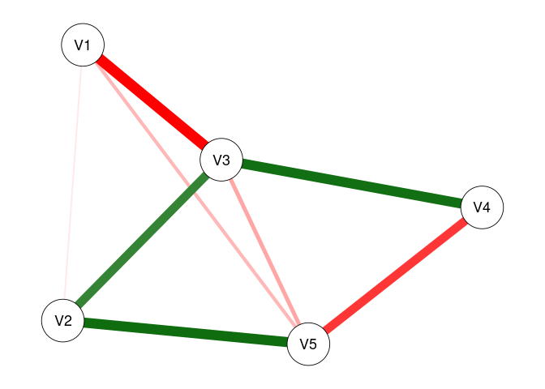

<!-- README.md is generated from README.Rmd. Please edit that file -->

# modnets

<!-- badges: start -->
<!-- badges: end -->

R package designed to afford exploratory and confirmatory estimation of
3 types of moderated networks:

1.  Cross-sectional moderated networks
    -   Involves nodewise estimation of a GGM with higher-order
        interactions
    -   Can accommodate any combination of continuous and binary
        variables.
    -   Nodewise regressions are fit using either OLS or logistic
        regression, depending on variable types.
2.  Idiographic (temporal) moderated networks
    -   Involves generalized least squares (GLS) estimation of
        multivariate time series model, as well as the
        inverse-covariance structure of the residuals.
    -   Currently only works for continuous variables, although
        exogenous moderators can be binary.
    -   Default estimation is seemingly unrelated regressions (SUR) via
        `systemfit`, but OLS is also available (unconstrained SUR
        estimates are equivalent to OLS estimates).
3.  Multi-level moderated networks
    -   Uses one of two methods for estimation.
    -   One is a two-step multilevel model, where fixed/random effects
        are estimated separately from between-subject effects
    -   The other uses a formal multilevel moderated vector
        autoregressive model with `lmer`
    -   Only works for continuous variables, although exogenous
        moderators can be binary.

Additionally, model selection techniques based on penalized regression
and iterative resampling are implemented alongside a variety of plotting
and data-generating functions.

## Installation

You can install the development version of modnets from
[GitHub](https://github.com/tswanson222/modnets) with:

``` r
# install.packages('devtools')
devtools::install_github('tswanson222/modnets')
```

## Usage

``` r
library(modnets)

data <- na.omit(psychTools::msq[, c('hostile', 'lonely', 'nervous', 'sleepy', 'depressed')])

fit <- fitNetwork(data, moderators = 'depressed')

plot(fit, threshold = TRUE)
```


## Package Functions

### Primary functions

-   The primary function used for the first two types of models is:
    `fitNetwork`. There are a variety of arguments and options that can
    be used for, e.g., penalized estimation, model specification, etc.
-   The primary functions used for the third model are: `mlGVAR` and
    `lmerVAR`, depending on which approach you wish to use.

### Model selection

-   For model selection, you can use `varSelect` to employ either
    best-subset selection (via `leaps`), the LASSO, ridge regression, or
    elastic net (via `glmnet`), or the hierarchical LASSO (via
    `glinternet`). These methods support various information criteria as
    well as cross-validation for model selection, and are embedded
    within the `varSelect` function.
-   As a note, all of the model selection procedures in `varSelect`
    operate on a sequential, nodewise basis.
-   Additionally, you can use the `resample` function to use repeated
    subsampling or bootstrapping with the `varSelect` algorithm built
    in.
-   This latter method will take into account the actual model-fit
    values (such as those obtained in the GLS-driven SUR for temporal
    networks)

### Stability & power analyses

-   Currently, these methods are not supported in the multilevel
    setting.
-   For bootstrapping/edge-weight accuracy analysis, you can use the
    `bootNet` function.
-   For case-dropping stability analysis, you can use `bootNet` while
    setting `caseDrop = TRUE`.
-   For power analysis, you can use: `mnetPowerSim` to simulate data
    based on expected network structure(s).

See the package description for an overview of these and other core
functions.

``` r
library(modnets)
?modnets
```

## Examples

### Cross-sectional moderated network

``` r
library(modnets)
# Package is now loaded! 

### ================================================ ###
### ======= SIMULATE MODERATED NETWORK DATA ======== ###
### ================================================ ###
# Can simulate data with no moderators, or with one exogenous moderator
set.seed(123)
x <- simNet(N = 500, p = 5, m = TRUE, m1 = .5, m2 = .2, nCores = TRUE)
#> Time difference of 19.52144 secs
str(x)
#> List of 6
#>  $ data      :'data.frame':  500 obs. of  6 variables:
#>   ..$ V1: num [1:500] -0.941 0.934 -1.157 -1.338 -1.466 ...
#>   ..$ V2: num [1:500] 0.797 1.493 0.249 1.418 1.333 ...
#>   ..$ V3: num [1:500] 0.0664 -1.2397 1.8628 1.025 -0.1681 ...
#>   ..$ V4: num [1:500] -1.171 -0.584 1.247 0.381 -1.067 ...
#>   ..$ V5: num [1:500] 0.373 0.225 -1.157 0.595 1.414 ...
#>   ..$ M : num [1:500] 1.251 -0.647 -0.834 -0.177 -2.021 ...
#>  $ b1        : num [1:5, 1:5] 0 0 -0.445 0 0 ...
#>   ..- attr(*, "dimnames")=List of 2
#>   .. ..$ : NULL
#>   .. ..$ : NULL
#>  $ b2        : num [1:5, 1:5] 0 0 0 0 0.193 ...
#>   ..- attr(*, "dimnames")=List of 2
#>   .. ..$ : NULL
#>   .. ..$ : NULL
#>  $ intercepts: num [1:5] 0 0 0 0 0
#>  $ m         : num -0.56
#>  $ m1        : num [1:5] 0.233 -0.34 -0.137 0 -0.162
#>  - attr(*, "m2")= num 2
#>  - attr(*, "modType")= chr "none"
#>  - attr(*, "class")= chr [1:2] "list" "ggmSim"
#>  - attr(*, "time")= 'difftime' num 19.52103972435
#>   ..- attr(*, "units")= chr "secs"
### Contents:
# x$data -------- 500x6 dataset, where 'M' is the moderator
# x$b1 ---------- true regression coefficients, where columns --> rows
# x$b2 ---------- true interaction coefficients, where (M * columns) --> rows
# x$intercepts -- true intercepts; defaults to 0
# x$m ----------- true mean of 'M'
# x$m1 ---------- coefficents for main effects of M on outcomes; default to 0

head(x$data)
#>           V1        V2          V3         V4         V5          M
#> 1 -0.9412513 0.7973435  0.06642949 -1.1707772  0.3729655  1.2508503
#> 2  0.9344922 1.4925422 -1.23965359 -0.5839143  0.2249768 -0.6468870
#> 3 -1.1573589 0.2491867  1.86280377  1.2469197 -1.1572764 -0.8335652
#> 4 -1.3384184 1.4178529  1.02499568  0.3808719  0.5946748 -0.1774740
#> 5 -1.4664497 1.3330882 -0.16812815 -1.0667748  1.4136349 -2.0209980
#> 6 -1.7884644 1.8177333 -0.36024505 -1.3038381  1.1417584 -2.1425579
print(x$b1)
#>           [,1]      [,2]       [,3]       [,4]       [,5]
#> [1,]  0.000000 0.0000000 -0.4449240  0.0000000  0.0000000
#> [2,]  0.000000 0.0000000  0.2829328  0.0000000  0.3307213
#> [3,] -0.444924 0.2829328  0.0000000  0.2991120  0.0000000
#> [4,]  0.000000 0.0000000  0.2991120  0.0000000 -0.3089766
#> [5,]  0.000000 0.3307213  0.0000000 -0.3089766  0.0000000
print(x$b2)
#>           [,1] [,2]      [,3] [,4]      [,5]
#> [1,] 0.0000000    0 0.0000000    0 0.1931925
#> [2,] 0.0000000    0 0.0000000    0 0.0000000
#> [3,] 0.0000000    0 0.0000000    0 0.2715655
#> [4,] 0.0000000    0 0.0000000    0 0.0000000
#> [5,] 0.1931925    0 0.2715655    0 0.0000000
print(x$intercepts)
#> [1] 0 0 0 0 0
print(x$m)
#> [1] -0.5604756
print(x$m1)
#> [1]  0.2326600 -0.3396775 -0.1365698  0.0000000 -0.1619594
dat0 <- x$data[, -6]
dat1 <- x$data
# First, lets save an object that excludes the moderator (dat0)
# and save a second with the moderator (dat1)


### ================================================ ###
### =============== FITTING MODELS ================= ###
### ================================================ ###
# First, lets fit an unmoderated network, leaving out 'M' entirely
fit0 <- fitNetwork(data = dat0) 

# Next, lets fit a model that only includes 'M' as a covariate
fit1 <- fitNetwork(data = dat1, covariates = 6) 

# Now, lets fit the saturated model where 'M' moderates all edges in the network
fit2 <- fitNetwork(data = dat1, moderators = 6) 


### ================= PLOTTING ===================== ###
plot(fit0)
```



``` r
plot(fit1)
```


``` r
plot(fit2)
```


``` r
# We can plot each of these models to see the resultant undirected network

plot(fit0, threshold = .05)
```


``` r
plot(fit1, threshold = .05)
```


``` r
plot(fit2, threshold = .05)
```


``` r
# Plot only significant edges (p < threshold) of the network.

plot(fit0, threshold = TRUE, predict = TRUE)
```


``` r
plot(fit1, threshold = TRUE, predict = 'R2')
```


``` r
plot(fit2, threshold = TRUE, predict = 'adjR2')
```


``` r
# Using 'threshold = TRUE' is the same as 'threshold = .05'
# 'predict = TRUE' plots R2 values for each regression
# This can also be specified as a string, as shown

plot(fit2, threshold = TRUE, predict = fit0)
```


``` r
# This can also be used to visually compare networks
# Here, the light blue ring around each node shows
# the R2 for 'fit0', while the slightly darker piece 
# shows the increase in R2 that we see with 'fit2'

predictNet(fit2)
#>   Variable    R2 adjR2   MSE  RMSE
#> 1       V1 0.284 0.271 1.029 1.014
#> 2       V2 0.337 0.325 1.005 1.003
#> 3       V3 0.450 0.440 0.930 0.964
#> 4       V4 0.330 0.317 0.945 0.972
#> 5       V5 0.398 0.387 0.941 0.970
predictNet(fit2, fit0)
#>   Variable    R2  adjR2    MSE   RMSE
#> 1       V1 0.099  0.092 -0.129 -0.062
#> 2       V2 0.065  0.058 -0.088 -0.042
#> 3       V3 0.052  0.046 -0.076 -0.039
#> 4       V4 0.002 -0.006  0.008  0.004
#> 5       V5 0.068  0.062 -0.095 -0.048
# We can extract these values using this function
# And can take the differences by supplying two networks
# Values for the second model are subtracted from those for the first

plot(fit2, mnet = TRUE)
```


``` r
plot(fit2, threshold = TRUE, mnet = TRUE)
```


``` r
# 'mnet = TRUE' plots the exogenous moderator


### ============= VARIABLE SELECTION =============== ###
# These methods demonstrate the two-stage process for variable selection
# In the first stage, we use the data to select the active set of predictors
# In the second stage, we use those predictors to re-fit the models using OLS

### UNMODERATED NETWORKS
vars0 <- varSelect(data = dat0, criterion = 'BIC', method = 'glmnet')
#> =================================================================================================================================
vfit0 <- fitNetwork(data = dat0, type = vars0)
vfit1 <- fitNetwork(data = dat0, type = 'varSelect', criterion = 'BIC')
predictNet(vfit0, vfit1)
#>   Variable R2 adjR2 MSE RMSE
#> 1       V1  0     0   0    0
#> 2       V2  0     0   0    0
#> 3       V3  0     0   0    0
#> 4       V4  0     0   0    0
#> 5       V5  0     0   0    0
# In the first method, we use glmnet to perform variable selection for 
# each of the nodewise models. Then, we can subsequently include this in the
# 'fitNetwork' function. In the second approach, we can simply include everything
# in one command. We see that these produce the exact same models

vfit2 <- fitNetwork(data = dat0, type = 'varSelect', criterion = 'BIC', method = 'subset')
# We can also use best-subsets selection instead of the LASSO

predictNet(vfit2, vfit1)
#>   Variable R2 adjR2 MSE RMSE
#> 1       V1  0     0   0    0
#> 2       V2  0     0   0    0
#> 3       V3  0     0   0    0
#> 4       V4  0     0   0    0
#> 5       V5  0     0   0    0
# In this case, we see that best-subsets produced lower R2 for three nodes

vfit3 <- fitNetwork(data = dat0, type = 'varSelect', criterion = 'CV', seed = 1)
vfit3.1 <- fitNetwork(data = dat0, type = 'varSelect', criterion = 'CV', seed = 1)
vfit3.2 <- fitNetwork(data = dat0, type = 'varSelect', criterion = 'CV', seed = 99)
# We can also use cross-validation with glmnet (but not best-subsets)

predictNet(vfit3, vfit3.1)
#>   Variable R2 adjR2 MSE RMSE
#> 1       V1  0     0   0    0
#> 2       V2  0     0   0    0
#> 3       V3  0     0   0    0
#> 4       V4  0     0   0    0
#> 5       V5  0     0   0    0
predictNet(vfit3, vfit3.2)
#>   Variable R2 adjR2 MSE RMSE
#> 1       V1  0     0   0    0
#> 2       V2  0     0   0    0
#> 3       V3  0     0   0    0
#> 4       V4  0     0   0    0
#> 5       V5  0     0   0    0
# We see that setting a seed leads to reproducible results


### MODERATED NETWORKS
vars1 <- varSelect(data = dat1, m = 6, criterion = 'BIC', method = 'glinternet')
#> Fitting model 1/5...  Complete! (0.11 secs)
#> Fitting model 2/5...  Complete! (0.09 secs)
#> Fitting model 3/5...  Complete! (0.06 secs)
#> Fitting model 4/5...  Complete! (0.04 secs)
#> Fitting model 5/5...  Complete! (0.08 secs)
#> ####### Total time: 0.39 secs
mfit1 <- fitNetwork(data = dat1, moderators = 6, type = vars1)
mfit2 <- fitNetwork(data = dat1, moderators = 6, type = 'varSelect', criterion = 'BIC')
predictNet(mfit1, mfit2)
#>   Variable R2 adjR2 MSE RMSE
#> 1       V1  0     0   0    0
#> 2       V2  0     0   0    0
#> 3       V3  0     0   0    0
#> 4       V4  0     0   0    0
#> 5       V5  0     0   0    0
# Again, we see that both methods produce the same model
# Creating the 'vars1' object separately can be useful when we wish
# to analyze the results from the variable selection process; plot outputs, obtain coefficients, etc.
# Also, all moderated networks use 'glinternet' as the selection method, and so it does not need to be specified

mfit2 <- fitNetwork(data = dat1, moderators = 6, type = 'varSelect', criterion = 'CV', seed = 1)
# We can use cross-validation with the glinternet algorithm as well


### ============== MODEL COMPARISON ================ ###
# Create a list of models we want to compare
fits <- list(fit0 = fit0, fit1 = fit1, fit2 = fit2, 
             vfit1 = vfit1, vfit2 = vfit2, vfit3 = vfit3,
             mfit1 = mfit1, mfit2 = mfit2)

modTable(fits)
#> $LRT
#>     net0  net1    Chisq Df   pval decision
#> 1   fit0  fit1  28.5999  5 0.0000     fit1
#> 2   fit0  fit2 175.8798 25 0.0000     fit2
#> 3  vfit1  fit0   0.2105  6 0.9998    vfit1
#> 4  vfit2  fit0   0.2105  6 0.9998    vfit2
#> 5  vfit3  fit0   0.2105  6 0.9998    vfit3
#> 6   fit0 mfit1 150.5626  5 0.0000    mfit1
#> 7   fit0 mfit2 171.1748 14 0.0000    mfit2
#> 8   fit1  fit2 147.2800 20 0.0000     fit2
#> 9  vfit1  fit1  28.8103 11 0.0024     fit1
#> 10 vfit2  fit1  28.8103 11 0.0024     fit1
#> 11 vfit3  fit1  28.8103 11 0.0024     fit1
#> 12  fit1 mfit1 121.9627  0 0.0000    mfit1
#> 13  fit1 mfit2 142.5749  9 0.0000    mfit2
#> 14 vfit1  fit2 176.0903 31 0.0000     fit2
#> 15 vfit2  fit2 176.0903 31 0.0000     fit2
#> 16 vfit3  fit2 176.0903 31 0.0000     fit2
#> 17 mfit1  fit2  25.3172 20 0.1896    mfit1
#> 18 mfit2  fit2   4.7050 11 0.9446    mfit2
#> 19 vfit1 vfit2   0.0000  0 1.0000       - 
#> 20 vfit1 vfit3   0.0000  0 1.0000       - 
#> 21 vfit1 mfit1 150.7730 11 0.0000    mfit1
#> 22 vfit1 mfit2 171.3853 20 0.0000    mfit2
#> 23 vfit2 vfit3   0.0000  0 1.0000       - 
#> 24 vfit2 mfit1 150.7730 11 0.0000    mfit1
#> 25 vfit2 mfit2 171.3853 20 0.0000    mfit2
#> 26 vfit3 mfit1 150.7730 11 0.0000    mfit1
#> 27 vfit3 mfit2 171.3853 20 0.0000    mfit2
#> 28 mfit1 mfit2  20.6122  9 0.0145    mfit2
#> 
#> $omnibus
#>              LL df      AIC      BIC LRT
#> mfit2 -3279.281 40 6638.562 6871.524   7
#> mfit1 -3289.587 31 6641.174 6821.720   6
#> fit2  -3276.928 51 6655.857 6952.883   5
#> fit1  -3350.568 31 6763.137 6943.682   4
#> vfit1 -3364.974 20 6769.947 6886.428   1
#> vfit2 -3364.974 20 6769.947 6886.428   1
#> vfit3 -3364.974 20 6769.947 6886.428   1
#> fit0  -3364.868 26 6781.737 6933.162   0
#> 
#> attr(,"alpha")
#> [1] 0.05
# Performs likelihood ratio tests comparing each model with every other

modTable(fits)$omnibus
#>              LL df      AIC      BIC LRT
#> mfit2 -3279.281 40 6638.562 6871.524   7
#> mfit1 -3289.587 31 6641.174 6821.720   6
#> fit2  -3276.928 51 6655.857 6952.883   5
#> fit1  -3350.568 31 6763.137 6943.682   4
#> vfit1 -3364.974 20 6769.947 6886.428   1
#> vfit2 -3364.974 20 6769.947 6886.428   1
#> vfit3 -3364.974 20 6769.947 6886.428   1
#> fit0  -3364.868 26 6781.737 6933.162   0
# This shows us the final results. The 'LRT' column indicates
# the total number of times each model was selected across all tests
# We can see that 'fit2' (the saturated MNM) was selected across all tests
# The second-most selected was 'mfit2', which used glinternet with CV selection

modTable(fits, nodes = TRUE)
#> $nodes
#> $nodes$V1
#>              LL  df      AIC      BIC
#> fit0  -743.6292 495 1499.258 1524.546
#> fit1  -733.3792 494 1480.758 1510.261
#> fit2  -711.4739 490 1444.948 1491.309
#> vfit1 -743.6811 497 1495.362 1512.221
#> vfit2 -743.6811 497 1495.362 1512.221
#> vfit3 -743.6811 497 1495.362 1512.221
#> mfit1 -714.3026 495 1440.605 1465.893
#> mfit2 -711.4739 490 1444.948 1491.309
#> 
#> $nodes$V2
#>              LL  df      AIC      BIC
#> fit0  -729.0996 495 1470.199 1495.487
#> fit1  -708.0513 494 1430.103 1459.605
#> fit2  -705.7560 490 1433.512 1479.873
#> vfit1 -729.1513 497 1466.303 1483.161
#> vfit2 -729.1513 497 1466.303 1483.161
#> vfit3 -729.1513 497 1466.303 1483.161
#> mfit1 -709.2924 496 1428.585 1449.658
#> mfit2 -705.7751 493 1427.550 1461.267
#> 
#> $nodes$V3
#>              LL  df      AIC      BIC
#> fit0  -708.4385 495 1428.877 1454.165
#> fit1  -708.4036 494 1430.807 1460.310
#> fit2  -686.1822 490 1394.364 1440.725
#> vfit1 -708.4385 495 1428.877 1454.165
#> vfit2 -708.4385 495 1428.877 1454.165
#> vfit3 -708.4385 495 1428.877 1454.165
#> mfit1 -686.4329 492 1390.866 1428.797
#> mfit2 -686.1968 491 1392.394 1434.540
#> 
#> $nodes$V4
#>              LL  df      AIC      BIC
#> fit0  -690.7154 495 1393.431 1418.718
#> fit1  -690.6988 494 1395.398 1424.900
#> fit2  -690.1962 490 1402.392 1448.753
#> vfit1 -690.7170 497 1389.434 1406.292
#> vfit2 -690.7170 497 1389.434 1406.292
#> vfit3 -690.7170 497 1389.434 1406.292
#> mfit1 -690.7170 497 1389.434 1406.292
#> mfit2 -690.7170 497 1389.434 1406.292
#> 
#> $nodes$V5
#>              LL  df      AIC      BIC
#> fit0  -715.7969 495 1443.594 1468.882
#> fit1  -714.8998 494 1443.800 1473.302
#> fit2  -689.2035 490 1400.407 1446.768
#> vfit1 -715.7969 495 1443.594 1468.882
#> vfit2 -715.7969 495 1443.594 1468.882
#> vfit3 -715.7969 495 1443.594 1468.882
#> mfit1 -689.2035 490 1400.407 1446.768
#> mfit2 -689.2035 490 1400.407 1446.768
#> 
#> 
#> $LRT
#> $LRT$LL_diff2
#>     net0  net1 |         V1          V2          V3          V4        V5
#> 1   fit0  fit1 | 20.4999332 42.09663311  0.06971115 0.033220662  1.794294
#> 2   fit0  fit2 | 64.3105018 46.68708980 44.51265081 1.038326202 53.186964
#> 3  vfit1  fit0 |  0.1039094  0.10340277  0.00000000 0.003192717  0.000000
#> 4  vfit2  fit0 |  0.1039094  0.10340277  0.00000000 0.003192717  0.000000
#> 5  vfit3  fit0 |  0.1039094  0.10340277  0.00000000 0.003192717  0.000000
#> 6   fit0 mfit1 | 58.6532382 39.61431422 44.01120634 0.003192717 53.186964
#> 7   fit0 mfit2 | 64.3105018 46.64907067 44.48329636 0.003192717 53.186964
#> 8   fit1  fit2 | 43.8105687  4.59045670 44.44293966 1.005105541 51.392670
#> 9  vfit1  fit1 | 20.6038426 42.20003588  0.06971115 0.036413379  1.794294
#> 10 vfit2  fit1 | 20.6038426 42.20003588  0.06971115 0.036413379  1.794294
#> 11 vfit3  fit1 | 20.6038426 42.20003588  0.06971115 0.036413379  1.794294
#> 12  fit1 mfit1 | 38.1533051  2.48231888 43.94149520 0.036413379 51.392670
#> 13  fit1 mfit2 | 43.8105687  4.55243756 44.41358521 0.036413379 51.392670
#> 14 vfit1  fit2 | 64.4144113 46.79049258 44.51265081 1.041518919 53.186964
#> 15 vfit2  fit2 | 64.4144113 46.79049258 44.51265081 1.041518919 53.186964
#> 16 vfit3  fit2 | 64.4144113 46.79049258 44.51265081 1.041518919 53.186964
#> 17 mfit1  fit2 |  5.6572636  7.07277558  0.50144447 1.041518919  0.000000
#> 18 mfit2  fit2 |  0.0000000  0.03801913  0.02935445 1.041518919  0.000000
#> 19 vfit1 vfit2 |  0.0000000  0.00000000  0.00000000 0.000000000  0.000000
#> 20 vfit1 vfit3 |  0.0000000  0.00000000  0.00000000 0.000000000  0.000000
#> 21 vfit1 mfit1 | 58.7571477 39.71771700 44.01120634 0.000000000 53.186964
#> 22 vfit1 mfit2 | 64.4144113 46.75247344 44.48329636 0.000000000 53.186964
#> 23 vfit2 vfit3 |  0.0000000  0.00000000  0.00000000 0.000000000  0.000000
#> 24 vfit2 mfit1 | 58.7571477 39.71771700 44.01120634 0.000000000 53.186964
#> 25 vfit2 mfit2 | 64.4144113 46.75247344 44.48329636 0.000000000 53.186964
#> 26 vfit3 mfit1 | 58.7571477 39.71771700 44.01120634 0.000000000 53.186964
#> 27 vfit3 mfit2 | 64.4144113 46.75247344 44.48329636 0.000000000 53.186964
#> 28 mfit1 mfit2 |  5.6572636  7.03475645  0.47209001 0.000000000  0.000000
#> 
#> $LRT$Df_diff
#>     net0  net1 | V1 V2 V3 V4 V5
#> 1   fit0  fit1 |  1  1  1  1  1
#> 2   fit0  fit2 |  5  5  5  5  5
#> 3  vfit1  fit0 |  2  2  0  2  0
#> 4  vfit2  fit0 |  2  2  0  2  0
#> 5  vfit3  fit0 |  2  2  0  2  0
#> 6   fit0 mfit1 |  0  1  3  2  5
#> 7   fit0 mfit2 |  5  2  4  2  5
#> 8   fit1  fit2 |  4  4  4  4  4
#> 9  vfit1  fit1 |  3  3  1  3  1
#> 10 vfit2  fit1 |  3  3  1  3  1
#> 11 vfit3  fit1 |  3  3  1  3  1
#> 12  fit1 mfit1 |  1  2  2  3  4
#> 13  fit1 mfit2 |  4  1  3  3  4
#> 14 vfit1  fit2 |  7  7  5  7  5
#> 15 vfit2  fit2 |  7  7  5  7  5
#> 16 vfit3  fit2 |  7  7  5  7  5
#> 17 mfit1  fit2 |  5  6  2  7  0
#> 18 mfit2  fit2 |  0  3  1  7  0
#> 19 vfit1 vfit2 |  0  0  0  0  0
#> 20 vfit1 vfit3 |  0  0  0  0  0
#> 21 vfit1 mfit1 |  2  1  3  0  5
#> 22 vfit1 mfit2 |  7  4  4  0  5
#> 23 vfit2 vfit3 |  0  0  0  0  0
#> 24 vfit2 mfit1 |  2  1  3  0  5
#> 25 vfit2 mfit2 |  7  4  4  0  5
#> 26 vfit3 mfit1 |  2  1  3  0  5
#> 27 vfit3 mfit2 |  7  4  4  0  5
#> 28 mfit1 mfit2 |  5  3  1  0  0
#> 
#> $LRT$pval
#>     net0  net1 |     V1     V2     V3     V4     V5
#> 1   fit0  fit1 | 0.0000 0.0000 0.7918 0.8554 0.1804
#> 2   fit0  fit2 | 0.0000 0.0000 0.0000 0.9594 0.0000
#> 3  vfit1  fit0 | 0.9494 0.9496 1.0000 0.9984 1.0000
#> 4  vfit2  fit0 | 0.9494 0.9496 1.0000 0.9984 1.0000
#> 5  vfit3  fit0 | 0.9494 0.9496 1.0000 0.9984 1.0000
#> 6   fit0 mfit1 | 0.0000 0.0000 0.0000 0.9984 0.0000
#> 7   fit0 mfit2 | 0.0000 0.0000 0.0000 0.9984 0.0000
#> 8   fit1  fit2 | 0.0000 0.3320 0.0000 0.9090 0.0000
#> 9  vfit1  fit1 | 0.0001 0.0000 0.7918 0.9982 0.1804
#> 10 vfit2  fit1 | 0.0001 0.0000 0.7918 0.9982 0.1804
#> 11 vfit3  fit1 | 0.0001 0.0000 0.7918 0.9982 0.1804
#> 12  fit1 mfit1 | 0.0000 0.2890 0.0000 0.9982 0.0000
#> 13  fit1 mfit2 | 0.0000 0.0329 0.0000 0.9982 0.0000
#> 14 vfit1  fit2 | 0.0000 0.0000 0.0000 0.9941 0.0000
#> 15 vfit2  fit2 | 0.0000 0.0000 0.0000 0.9941 0.0000
#> 16 vfit3  fit2 | 0.0000 0.0000 0.0000 0.9941 0.0000
#> 17 mfit1  fit2 | 0.3410 0.3142 0.7782 0.9941 1.0000
#> 18 mfit2  fit2 | 1.0000 0.9981 0.8640 0.9941 1.0000
#> 19 vfit1 vfit2 | 1.0000 1.0000 1.0000 1.0000 1.0000
#> 20 vfit1 vfit3 | 1.0000 1.0000 1.0000 1.0000 1.0000
#> 21 vfit1 mfit1 | 0.0000 0.0000 0.0000 1.0000 0.0000
#> 22 vfit1 mfit2 | 0.0000 0.0000 0.0000 1.0000 0.0000
#> 23 vfit2 vfit3 | 1.0000 1.0000 1.0000 1.0000 1.0000
#> 24 vfit2 mfit1 | 0.0000 0.0000 0.0000 1.0000 0.0000
#> 25 vfit2 mfit2 | 0.0000 0.0000 0.0000 1.0000 0.0000
#> 26 vfit3 mfit1 | 0.0000 0.0000 0.0000 1.0000 0.0000
#> 27 vfit3 mfit2 | 0.0000 0.0000 0.0000 1.0000 0.0000
#> 28 mfit1 mfit2 | 0.3410 0.0708 0.4920 1.0000 1.0000
#> 
#> $LRT$decision
#>     net0  net1 |    V1    V2    V3    V4    V5
#> 1   fit0  fit1 |  fit1  fit1  fit0  fit0  fit0
#> 2   fit0  fit2 |  fit2  fit2  fit2  fit0  fit2
#> 3  vfit1  fit0 | vfit1 vfit1    -  vfit1    - 
#> 4  vfit2  fit0 | vfit2 vfit2    -  vfit2    - 
#> 5  vfit3  fit0 | vfit3 vfit3    -  vfit3    - 
#> 6   fit0 mfit1 | mfit1 mfit1 mfit1 mfit1 mfit1
#> 7   fit0 mfit2 | mfit2 mfit2 mfit2 mfit2 mfit2
#> 8   fit1  fit2 |  fit2  fit1  fit2  fit1  fit2
#> 9  vfit1  fit1 |  fit1  fit1 vfit1 vfit1 vfit1
#> 10 vfit2  fit1 |  fit1  fit1 vfit2 vfit2 vfit2
#> 11 vfit3  fit1 |  fit1  fit1 vfit3 vfit3 vfit3
#> 12  fit1 mfit1 | mfit1 mfit1 mfit1 mfit1 mfit1
#> 13  fit1 mfit2 | mfit2 mfit2 mfit2 mfit2 mfit2
#> 14 vfit1  fit2 |  fit2  fit2  fit2 vfit1  fit2
#> 15 vfit2  fit2 |  fit2  fit2  fit2 vfit2  fit2
#> 16 vfit3  fit2 |  fit2  fit2  fit2 vfit3  fit2
#> 17 mfit1  fit2 | mfit1 mfit1 mfit1 mfit1    - 
#> 18 mfit2  fit2 |    -  mfit2 mfit2 mfit2    - 
#> 19 vfit1 vfit2 |    -     -     -     -     - 
#> 20 vfit1 vfit3 |    -     -     -     -     - 
#> 21 vfit1 mfit1 | mfit1 mfit1 mfit1    -  mfit1
#> 22 vfit1 mfit2 | mfit2 mfit2 mfit2    -  mfit2
#> 23 vfit2 vfit3 |    -     -     -     -     - 
#> 24 vfit2 mfit1 | mfit1 mfit1 mfit1    -  mfit1
#> 25 vfit2 mfit2 | mfit2 mfit2 mfit2    -  mfit2
#> 26 vfit3 mfit1 | mfit1 mfit1 mfit1    -  mfit1
#> 27 vfit3 mfit2 | mfit2 mfit2 mfit2    -  mfit2
#> 28 mfit1 mfit2 | mfit1 mfit1 mfit1    -     - 
#> 
#> 
#> $counts
#>       V1 V2 V3 V4 V5
#> fit0   0  0  1  2  1
#> fit1   4  5  0  1  0
#> fit2   5  4  5  0  5
#> vfit1  1  1  1  3  1
#> vfit2  1  1  1  3  1
#> vfit3  1  1  1  3  1
#> mfit1  7  7  7  3  5
#> mfit2  5  6  6  3  5
#> 
#> attr(,"alpha")
#> [1] 0.05
# This does the same thing as above but at the nodewise level
```

More examples to be added soon.

Please contact <trevorswanson222@gmail.com> with any questions.
