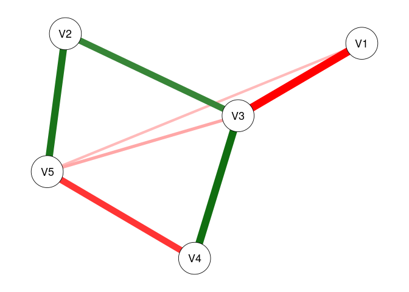

<!-- README.md is generated from README.Rmd. Please edit that file -->

# modnets

<!-- badges: start -->
<!-- badges: end -->

R package designed to afford exploratory and confirmatory estimation of
3 types of moderated networks:

1.  Cross-sectional moderated networks
    -   Involves nodewise estimation of a GGM with higher-order
        interactions
    -   Can accomodate any combination of continuous and binary
        variables.
    -   Nodewise regressions are fit using either OLS or logistic
        regression, depending on variable types.
2.  Idiographic (temporal) moderated networks
    -   Involves generalized least squares (GLS) estimation of
        multivariate time series model, as well as the
        inverse-covariance structure of the residuals.
    -   Currently only works for continuous variables, although
        exogenous moderators can be binary.
    -   Default estimation is seemingly unrelated regressions (SUR) via
        `systemfit`, but OLS is also available (unconstrained SUR
        estimates are equivalent to OLS estimates).
3.  Multi-level moderated networks
    -   Uses one of two methods for estimation.
    -   One is a two-step multilevel model, where fixed/random effects
        are estimated separately from between-subject effects
    -   The other uses a formal multilevel moderated vector
        autoregressive model with `lmer`
    -   Only works for continous variables, although exogenous
        moderators can be binary.

Penalized estimators for each of these models are also available, such
as the LASSO, ridge regression, elastic net, the (overlapping) group
LASSO, and the hierarchical LASSO. Hyperparameter selection will be
performed automatically based on either the AIC, BIC, EBIC, or
cross-validation depending upon user input.

## Installation

You can install the development version of modnets from
[GitHub](https://github.com/tswanson222/modnets) with:

``` r
# install.packages('devtools')
devtools::install_github('tswanson222/modnets')
```

## Usage

``` r
library(modnets)

data <- na.omit(psychTools::msq[, c('hostile', 'lonely', 'nervous', 'sleepy', 'depressed')])

fit <- fitNetwork(data, moderators = 'depressed')

plot(fit, threshold = TRUE)
```


## Package Functions

### Primary functions

-   The primary function used for the first two types of models is:
    `fitNetwork`. There are a variety of arguments and options that can
    be used for, e.g., penalized estimation, model specification, etc.
-   The primary functions used for the third model are: `mlGVAR` and
    `lmerVAR`, depending on which approach you wish to use.

### Model selection

-   For model selection, you can use `varSelect` to employ either
    best-subset selection (via `leaps`), the LASSO, ridge regression, or
    elastic net (via `glmnet`), or the hierarchical LASSO (via
    `glinternet`). These methods support various information criteria as
    well as cross-validation for model selection, and are embedded
    within the `varSelect` function.
-   As a note, all of the model selection procedures in `varSelect`
    operate on a sequential, nodewise basis.
-   Additionally, you can use the `resample` function to use repeated
    subsampling or bootstrapping with the `varSelect` algorithm built
    in.
-   This latter method will take into account the actual model-fit
    values (such as those obtained in the GLS-driven SUR for temporal
    networks)

### Stability & power analyses

-   Currently, these methods are not supported in the multilevel
    setting.
-   For bootstrapping/edge-weight accuracy analysis, you can use the
    `bootNet` function.
-   For case-dropping stability analysis, you can use `bootNet` while
    setting `caseDrop = TRUE`.
-   For power analysis, you can use: `mnetPowerSim` to simulate data
    based on expected network structure(s).

## Examples

### Cross-sectional moderated network

``` r
library(modnets)
# Package is now loaded! 

### ================================================ ###
### ======= SIMULATE MODERATED NETWORK DATA ======== ###
### ================================================ ###
# Can simulate data with no moderators, or with one exogenous moderator
set.seed(123)
x <- simNet(N = 500, p = 5, m = TRUE, m1 = .5, m2 = .2, nCores = TRUE)
#> Time difference of 15.09191 secs
str(x)
#> List of 6
#>  $ data      :'data.frame':  500 obs. of  6 variables:
#>   ..$ V1: num [1:500] -1.762 0.123 -1.099 -0.653 0.964 ...
#>   ..$ V2: num [1:500] 1.13 -0.081 0.211 -0.71 1.279 ...
#>   ..$ V3: num [1:500] 0.814 -1.958 -0.982 0.145 -2.079 ...
#>   ..$ V4: num [1:500] -0.1808 -0.83 0.4635 -0.0994 -2.3544 ...
#>   ..$ V5: num [1:500] -0.5963 1.0929 -0.0837 0.0816 1.3479 ...
#>   ..$ M : num [1:500] -1.091 -0.168 0.267 -2.032 -0.662 ...
#>  $ b1        : num [1:5, 1:5] 0 0 -0.445 0 0 ...
#>   ..- attr(*, "dimnames")=List of 2
#>   .. ..$ : NULL
#>   .. ..$ : NULL
#>  $ b2        : num [1:5, 1:5] 0 0 0 0 0.193 ...
#>   ..- attr(*, "dimnames")=List of 2
#>   .. ..$ : NULL
#>   .. ..$ : NULL
#>  $ intercepts: num [1:5] 0 0 0 0 0
#>  $ m         : num -0.56
#>  $ m1        : num [1:5] 0.233 -0.34 -0.137 0 -0.162
#>  - attr(*, "m2")= num 2
#>  - attr(*, "modType")= chr "none"
#>  - attr(*, "class")= chr [1:2] "list" "ggmSim"
#>  - attr(*, "time")= 'difftime' num 15.0916137695312
#>   ..- attr(*, "units")= chr "secs"
### Contents:
# x$data -------- 500x6 dataset, where 'M' is the moderator
# x$b1 ---------- true regression coefficients, where columns --> rows
# x$b2 ---------- true interaction coefficients, where (M * columns) --> rows
# x$intercepts -- true intercepts; defaults to 0
# x$m ----------- true mean of 'M'
# x$m1 ---------- coefficents for main effects of M on outcomes; default to 0

head(x$data)
#>           V1          V2            V3          V4          V5          M
#> 1 -1.7617490  1.13049203  0.8141074184 -0.18076301 -0.59631580 -1.0909959
#> 2  0.1227934 -0.08103882 -1.9584490429 -0.83000946  1.09285186 -0.1678799
#> 3 -1.0986199  0.21101203 -0.9815222251  0.46346755 -0.08373201  0.2673578
#> 4 -0.6528195 -0.71001090  0.1452445349 -0.09944813  0.08159889 -2.0322138
#> 5  0.9643925  1.27903168 -2.0792635467 -2.35441826  1.34794661 -0.6623027
#> 6  1.0923543  0.97280073  0.0004884396 -0.37929142  1.31508130 -0.2515930
print(x$b1)
#>           [,1]      [,2]       [,3]       [,4]       [,5]
#> [1,]  0.000000 0.0000000 -0.4449240  0.0000000  0.0000000
#> [2,]  0.000000 0.0000000  0.2829328  0.0000000  0.3307213
#> [3,] -0.444924 0.2829328  0.0000000  0.2991120  0.0000000
#> [4,]  0.000000 0.0000000  0.2991120  0.0000000 -0.3089766
#> [5,]  0.000000 0.3307213  0.0000000 -0.3089766  0.0000000
print(x$b2)
#>           [,1] [,2]      [,3] [,4]      [,5]
#> [1,] 0.0000000    0 0.0000000    0 0.1931925
#> [2,] 0.0000000    0 0.0000000    0 0.0000000
#> [3,] 0.0000000    0 0.0000000    0 0.2715655
#> [4,] 0.0000000    0 0.0000000    0 0.0000000
#> [5,] 0.1931925    0 0.2715655    0 0.0000000
print(x$intercepts)
#> [1] 0 0 0 0 0
print(x$m)
#> [1] -0.5604756
print(x$m1)
#> [1]  0.2326600 -0.3396775 -0.1365698  0.0000000 -0.1619594
dat0 <- x$data[, -6]
dat1 <- x$data
# First, lets save an object that excludes the moderator (dat0)
# and save a second with the moderator (dat1)


### ================================================ ###
### =============== FITTING MODELS ================= ###
### ================================================ ###
# First, lets fit an unmoderated network, leaving out 'M' entirely
fit0 <- fitNetwork(data = dat0) 

# Next, lets fit a model that only includes 'M' as a covariate
fit1 <- fitNetwork(data = dat1, covariates = 6) 

# Now, lets fit the saturated model where 'M' moderates all edges in the network
fit2 <- fitNetwork(data = dat1, moderators = 6) 


### ================= PLOTTING ===================== ###
plot(fit0)
```


``` r
plot(fit1)
```


``` r
plot(fit2)
```


``` r
# We can plot each of these models to see the resultant undirected network

plot(fit0, threshold = .05)
```


``` r
plot(fit1, threshold = .05)
```



``` r
plot(fit2, threshold = .05)
```


``` r
# Plot only significant edges (p < threshold) of the network.

plot(fit0, threshold = TRUE, predict = TRUE)
```


``` r
plot(fit1, threshold = TRUE, predict = 'R2')
```


``` r
plot(fit2, threshold = TRUE, predict = 'adjR2')
```


``` r
# Using 'threshold = TRUE' is the same as 'threshold = .05'
# 'predict = TRUE' plots R2 values for each regression
# This can also be specified as a string, as shown

plot(fit2, threshold = TRUE, predict = fit0)
```


``` r
# This can also be used to visually compare networks
# Here, the light blue ring around each node shows
# the R2 for 'fit0', while the slightly darker piece 
# shows the increase in R2 that we see with 'fit2'

predictNet(fit2)
#>   Variable    R2 adjR2   MSE  RMSE
#> 1       V1 0.350 0.338 0.956 0.978
#> 2       V2 0.310 0.298 0.939 0.969
#> 3       V3 0.533 0.524 0.891 0.944
#> 4       V4 0.295 0.283 0.992 0.996
#> 5       V5 0.353 0.341 0.966 0.983
predictNet(fit2, fit0)
#>   Variable    R2 adjR2    MSE   RMSE
#> 1       V1 0.089 0.082 -0.119 -0.059
#> 2       V2 0.043 0.037 -0.049 -0.025
#> 3       V3 0.063 0.058 -0.109 -0.056
#> 4       V4 0.011 0.005 -0.005 -0.003
#> 5       V5 0.089 0.083 -0.122 -0.060
# We can extract these values using this function
# And can take the differences by supplying two networks
# Values for the second model are subtracted from those for the first

plot(fit2, mnet = TRUE)
```


``` r
plot(fit2, threshold = TRUE, mnet = TRUE)
```


``` r
# 'mnet = TRUE' plots the exogenous moderator


### ============= VARIABLE SELECTION =============== ###
# These methods demonstrate the two-stage process for variable selection
# In the first stage, we use the data to select the active set of predictors
# In the second stage, we use those predictors to re-fit the models using OLS

### UNMODERATED NETWORKS
vars0 <- varSelect(data = dat0, criterion = 'BIC', method = 'glmnet')
#> =================================================================================================================================
vfit0 <- fitNetwork(data = dat0, type = vars0)
vfit1 <- fitNetwork(data = dat0, type = 'varSelect', criterion = 'BIC')
predictNet(vfit0, vfit1)
#>   Variable R2 adjR2 MSE RMSE
#> 1       V1  0     0   0    0
#> 2       V2  0     0   0    0
#> 3       V3  0     0   0    0
#> 4       V4  0     0   0    0
#> 5       V5  0     0   0    0
# In the first method, we use glmnet to perform variable selection for 
# each of the nodewise models. Then, we can subsequently include this in the
# 'fitNetwork' function. In the second approach, we can simply include everything
# in one command. We see that these produce the exact same models

vfit2 <- fitNetwork(data = dat0, type = 'varSelect', criterion = 'BIC', method = 'subset')
# We can also use best-subsets selection instead of the LASSO

predictNet(vfit2, vfit1)
#>   Variable     R2 adjR2    MSE RMSE
#> 1       V1 -0.001 0.001 -0.001    0
#> 2       V2 -0.001 0.000 -0.001    0
#> 3       V3  0.000 0.000  0.000    0
#> 4       V4  0.000 0.000  0.000    0
#> 5       V5  0.000 0.000  0.000    0
# In this case, we see that best-subsets produced lower R2 for three nodes

vfit3 <- fitNetwork(data = dat0, type = 'varSelect', criterion = 'CV', seed = 1)
vfit3.1 <- fitNetwork(data = dat0, type = 'varSelect', criterion = 'CV', seed = 1)
vfit3.2 <- fitNetwork(data = dat0, type = 'varSelect', criterion = 'CV', seed = 99)
# We can also use cross-validation with glmnet (but not best-subsets)

predictNet(vfit3, vfit3.1)
#>   Variable R2 adjR2 MSE RMSE
#> 1       V1  0     0   0    0
#> 2       V2  0     0   0    0
#> 3       V3  0     0   0    0
#> 4       V4  0     0   0    0
#> 5       V5  0     0   0    0
predictNet(vfit3, vfit3.2)
#>   Variable     R2  adjR2   MSE RMSE
#> 1       V1  0.000  0.000 0.000    0
#> 2       V2  0.000  0.000 0.000    0
#> 3       V3  0.000  0.000 0.000    0
#> 4       V4 -0.002 -0.001 0.001    0
#> 5       V5  0.000  0.000 0.000    0
# We see that setting a seed leads to reproducible results


### MODERATED NETWORKS
vars1 <- varSelect(data = dat1, m = 6, criterion = 'BIC', method = 'glinternet')
#> Fitting model 1/5...  Complete! (0.1 secs)
#> Fitting model 2/5...  Complete! (0.12 secs)
#> Fitting model 3/5...  Complete! (0.07 secs)
#> Fitting model 4/5...  Complete! (0.06 secs)
#> Fitting model 5/5...  Complete! (0.06 secs)
#> ####### Total time: 0.41 secs
mfit1 <- fitNetwork(data = dat1, moderators = 6, type = vars1)
mfit2 <- fitNetwork(data = dat1, moderators = 6, type = 'varSelect', criterion = 'BIC')
predictNet(mfit1, mfit2)
#>   Variable R2 adjR2 MSE RMSE
#> 1       V1  0     0   0    0
#> 2       V2  0     0   0    0
#> 3       V3  0     0   0    0
#> 4       V4  0     0   0    0
#> 5       V5  0     0   0    0
# Again, we see that both methods produce the same model
# Creating the 'vars1' object separately can be useful when we wish
# to analyze the results from the variable selection process; plot outputs, obtain coefficients, etc.
# Also, all moderated networks use 'glinternet' as the selection method, and so it does not need to be specified

mfit2 <- fitNetwork(data = dat1, moderators = 6, type = 'varSelect', criterion = 'CV', seed = 1)
# We can use cross-validation with the glinternet algorithm as well


### ============== MODEL COMPARISON ================ ###
# Create a list of models we want to compare
fits <- list(fit0 = fit0, fit1 = fit1, fit2 = fit2, 
             vfit1 = vfit1, vfit2 = vfit2, vfit3 = vfit3,
             mfit1 = mfit1, mfit2 = mfit2)

modTable(fits)
#> $LRT
#>     net0  net1    Chisq Df   pval decision
#> 1   fit0  fit1   2.1419  5 0.8292     fit0
#> 2   fit0  fit2 177.2748 25 0.0000     fit2
#> 3  vfit1  fit0   2.5631  4 0.6334    vfit1
#> 4  vfit2  fit0   3.9289  6 0.6863    vfit2
#> 5  vfit3  fit0   2.5616  3 0.4643    vfit3
#> 6   fit0 mfit1 166.1562  4 0.0000    mfit1
#> 7   fit0 mfit2 170.4470 15 0.0000    mfit2
#> 8   fit1  fit2 175.1329 20 0.0000     fit2
#> 9  vfit1  fit1   4.7050  9 0.8592    vfit1
#> 10 vfit2  fit1   6.0708 11 0.8686    vfit2
#> 11 vfit3  fit1   4.7034  8 0.7888    vfit3
#> 12 mfit1  fit1 164.0144  1 0.0000    mfit1
#> 13  fit1 mfit2 168.3051 10 0.0000    mfit2
#> 14 vfit1  fit2 179.8379 29 0.0000     fit2
#> 15 vfit2  fit2 181.2037 31 0.0000     fit2
#> 16 vfit3  fit2 179.8363 28 0.0000     fit2
#> 17 mfit1  fit2  11.1185 21 0.9604    mfit1
#> 18 mfit2  fit2   6.8278 10 0.7416    mfit2
#> 19 vfit2 vfit1   1.3658  2 0.5051    vfit2
#> 20 vfit1 vfit3   0.0015  1 0.9686    vfit1
#> 21 vfit1 mfit1 168.7194  8 0.0000    mfit1
#> 22 vfit1 mfit2 173.0101 19 0.0000    mfit2
#> 23 vfit2 vfit3   1.3674  3 0.7132    vfit2
#> 24 vfit2 mfit1 170.0852 10 0.0000    mfit1
#> 25 vfit2 mfit2 174.3759 21 0.0000    mfit2
#> 26 vfit3 mfit1 168.7178  7 0.0000    mfit1
#> 27 vfit3 mfit2 173.0085 18 0.0000    mfit2
#> 28 mfit1 mfit2   4.2907 11 0.9606    mfit1
#> 
#> $omnibus
#>              LL df      AIC      BIC LRT
#> mfit1 -3260.342 30 6580.685 6755.406   7
#> mfit2 -3258.197 41 6598.394 6837.180   6
#> fit2  -3254.783 51 6611.566 6908.593   5
#> vfit2 -3345.385 20 6730.770 6847.251   4
#> vfit1 -3344.702 22 6733.404 6861.533   3
#> vfit3 -3344.701 23 6735.403 6869.356   2
#> fit0  -3343.420 26 6738.841 6890.266   1
#> fit1  -3342.350 31 6746.699 6927.245   0
#> 
#> attr(,"alpha")
#> [1] 0.05
# Performs likelihood ratio tests comparing each model with every other

modTable(fits)$omnibus
#>              LL df      AIC      BIC LRT
#> mfit1 -3260.342 30 6580.685 6755.406   7
#> mfit2 -3258.197 41 6598.394 6837.180   6
#> fit2  -3254.783 51 6611.566 6908.593   5
#> vfit2 -3345.385 20 6730.770 6847.251   4
#> vfit1 -3344.702 22 6733.404 6861.533   3
#> vfit3 -3344.701 23 6735.403 6869.356   2
#> fit0  -3343.420 26 6738.841 6890.266   1
#> fit1  -3342.350 31 6746.699 6927.245   0
# This shows us the final results. The 'LRT' column indicates
# the total number of times each model was selected across all tests
# We can see that 'fit2' (the saturated MNM) was selected across all tests
# The second-most selected was 'mfit2', which used glinternet with CV selection

modTable(fits, nodes = TRUE)
#> $nodes
#> $nodes$V1
#>              LL  df      AIC      BIC
#> fit0  -724.9472 495 1461.894 1487.182
#> fit1  -715.2673 494 1444.535 1474.037
#> fit2  -693.1233 490 1408.247 1454.607
#> vfit1 -725.5861 496 1461.172 1482.245
#> vfit2 -725.9276 497 1459.855 1476.714
#> vfit3 -724.9472 495 1461.894 1487.182
#> mfit1 -697.5251 495 1407.050 1432.338
#> mfit2 -693.1233 490 1408.247 1454.607
#> 
#> $nodes$V2
#>              LL  df      AIC      BIC
#> fit0  -703.8815 495 1419.763 1445.051
#> fit1  -694.5883 494 1403.177 1432.679
#> fit2  -688.7575 490 1399.515 1445.876
#> vfit1 -703.8833 496 1417.767 1438.840
#> vfit2 -704.2248 497 1416.450 1433.308
#> vfit3 -703.8833 496 1417.767 1438.840
#> mfit1 -689.4550 494 1392.910 1422.412
#> mfit2 -688.9775 492 1395.955 1433.886
#> 
#> $nodes$V3
#>              LL  df      AIC      BIC
#> fit0  -706.8915 495 1425.783 1451.071
#> fit1  -706.1066 494 1426.213 1455.715
#> fit2  -675.4728 490 1372.946 1419.306
#> vfit1 -706.8915 495 1425.783 1451.071
#> vfit2 -706.8915 495 1425.783 1451.071
#> vfit3 -706.8915 495 1425.783 1451.071
#> mfit1 -676.0784 493 1368.157 1401.874
#> mfit2 -676.0784 493 1368.157 1401.874
#> 
#> $nodes$V4
#>              LL  df      AIC      BIC
#> fit0  -706.3256 495 1424.651 1449.939
#> fit1  -705.8439 494 1425.688 1455.190
#> fit2  -702.3519 490 1426.704 1473.065
#> vfit1 -706.9648 497 1421.930 1438.788
#> vfit2 -706.9648 497 1421.930 1438.788
#> vfit3 -706.9648 497 1421.930 1438.788
#> mfit1 -706.9648 497 1421.930 1438.788
#> mfit2 -702.5885 493 1421.177 1454.894
#> 
#> $nodes$V5
#>              LL  df      AIC      BIC
#> fit0  -727.9637 495 1467.927 1493.215
#> fit1  -726.0677 494 1466.135 1495.638
#> fit2  -695.7346 490 1413.469 1459.830
#> vfit1 -727.9637 495 1467.927 1493.215
#> vfit2 -727.9637 495 1467.927 1493.215
#> vfit3 -727.9637 495 1467.927 1493.215
#> mfit1 -695.9740 492 1409.948 1447.879
#> mfit2 -695.9740 492 1409.948 1447.879
#> 
#> 
#> $LRT
#> $LRT$LL_diff2
#>     net0  net1 |         V1           V2       V3        V4         V5
#> 1   fit0  fit1 | 19.3597839 18.586285609  1.56987 0.9634288  3.7918609
#> 2   fit0  fit2 | 63.6476823 30.247865134 62.83751 7.9473972 64.4580263
#> 3  vfit1  fit0 |  1.2779266  0.003637967  0.00000 1.2782694  0.0000000
#> 4  vfit2  fit0 |  1.9608343  0.686545624  0.00000 1.2782694  0.0000000
#> 5  vfit3  fit0 |  0.0000000  0.003637967  0.00000 1.2782694  0.0000000
#> 6   fit0 mfit1 | 54.8440771 28.853061612 61.62617 1.2782694 63.9793488
#> 7   fit0 mfit2 | 63.6476823 29.808016741 61.62617 7.4742321 63.9793488
#> 8   fit1  fit2 | 44.2878984 11.661579525 61.26764 6.9839683 60.6661653
#> 9  vfit1  fit1 | 20.6377106 18.589923576  1.56987 2.2416982  3.7918609
#> 10 vfit2  fit1 | 21.3206182 19.272831233  1.56987 2.2416982  3.7918609
#> 11 vfit3  fit1 | 19.3597839 18.589923576  1.56987 2.2416982  3.7918609
#> 12 mfit1  fit1 | 35.4842932 10.266776003 60.05630 2.2416982 60.1874879
#> 13  fit1 mfit2 | 44.2878984 11.221731132 60.05630 6.5108033 60.1874879
#> 14 vfit1  fit2 | 64.9256090 30.251503101 62.83751 9.2256666 64.4580263
#> 15 vfit2  fit2 | 65.6085166 30.934410758 62.83751 9.2256666 64.4580263
#> 16 vfit3  fit2 | 63.6476823 30.251503101 62.83751 9.2256666 64.4580263
#> 17 mfit1  fit2 |  8.8036052  1.394803522  1.21134 9.2256666  0.4786774
#> 18 mfit2  fit2 |  0.0000000  0.439848393  1.21134 0.4731650  0.4786774
#> 19 vfit2 vfit1 |  0.6829077  0.682907657  0.00000 0.0000000  0.0000000
#> 20 vfit1 vfit3 |  1.2779266  0.000000000  0.00000 0.0000000  0.0000000
#> 21 vfit1 mfit1 | 56.1220037 28.856699578 61.62617 0.0000000 63.9793488
#> 22 vfit1 mfit2 | 64.9256090 29.811654708 61.62617 8.7525016 63.9793488
#> 23 vfit2 vfit3 |  1.9608343  0.682907657  0.00000 0.0000000  0.0000000
#> 24 vfit2 mfit1 | 56.8049114 29.539607236 61.62617 0.0000000 63.9793488
#> 25 vfit2 mfit2 | 65.6085166 30.494562366 61.62617 8.7525016 63.9793488
#> 26 vfit3 mfit1 | 54.8440771 28.856699578 61.62617 0.0000000 63.9793488
#> 27 vfit3 mfit2 | 63.6476823 29.811654708 61.62617 8.7525016 63.9793488
#> 28 mfit1 mfit2 |  8.8036052  0.954955130  0.00000 8.7525016  0.0000000
#> 
#> $LRT$Df_diff
#>     net0  net1 | V1 V2 V3 V4 V5
#> 1   fit0  fit1 |  1  1  1  1  1
#> 2   fit0  fit2 |  5  5  5  5  5
#> 3  vfit1  fit0 |  1  1  0  2  0
#> 4  vfit2  fit0 |  2  2  0  2  0
#> 5  vfit3  fit0 |  0  1  0  2  0
#> 6   fit0 mfit1 |  0  1  2  2  3
#> 7   fit0 mfit2 |  5  3  2  2  3
#> 8   fit1  fit2 |  4  4  4  4  4
#> 9  vfit1  fit1 |  2  2  1  3  1
#> 10 vfit2  fit1 |  3  3  1  3  1
#> 11 vfit3  fit1 |  1  2  1  3  1
#> 12 mfit1  fit1 |  1  0  1  3  2
#> 13  fit1 mfit2 |  4  2  1  1  2
#> 14 vfit1  fit2 |  6  6  5  7  5
#> 15 vfit2  fit2 |  7  7  5  7  5
#> 16 vfit3  fit2 |  5  6  5  7  5
#> 17 mfit1  fit2 |  5  4  3  7  2
#> 18 mfit2  fit2 |  0  2  3  3  2
#> 19 vfit2 vfit1 |  1  1  0  0  0
#> 20 vfit1 vfit3 |  1  0  0  0  0
#> 21 vfit1 mfit1 |  1  2  2  0  3
#> 22 vfit1 mfit2 |  6  4  2  4  3
#> 23 vfit2 vfit3 |  2  1  0  0  0
#> 24 vfit2 mfit1 |  2  3  2  0  3
#> 25 vfit2 mfit2 |  7  5  2  4  3
#> 26 vfit3 mfit1 |  0  2  2  0  3
#> 27 vfit3 mfit2 |  5  4  2  4  3
#> 28 mfit1 mfit2 |  5  2  0  4  0
#> 
#> $LRT$pval
#>     net0  net1 |     V1     V2     V3     V4     V5
#> 1   fit0  fit1 | 0.0000 0.0000 0.2102 0.3263 0.0515
#> 2   fit0  fit2 | 0.0000 0.0000 0.0000 0.1592 0.0000
#> 3  vfit1  fit0 | 0.2583 0.9519 1.0000 0.5277 1.0000
#> 4  vfit2  fit0 | 0.3752 0.7094 1.0000 0.5277 1.0000
#> 5  vfit3  fit0 | 1.0000 0.9519 1.0000 0.5277 1.0000
#> 6   fit0 mfit1 | 0.0000 0.0000 0.0000 0.5277 0.0000
#> 7   fit0 mfit2 | 0.0000 0.0000 0.0000 0.0238 0.0000
#> 8   fit1  fit2 | 0.0000 0.0201 0.0000 0.1367 0.0000
#> 9  vfit1  fit1 | 0.0000 0.0001 0.2102 0.5238 0.0515
#> 10 vfit2  fit1 | 0.0001 0.0002 0.2102 0.5238 0.0515
#> 11 vfit3  fit1 | 0.0000 0.0001 0.2102 0.5238 0.0515
#> 12 mfit1  fit1 | 0.0000 0.0000 0.0000 0.5238 0.0000
#> 13  fit1 mfit2 | 0.0000 0.0037 0.0000 0.0107 0.0000
#> 14 vfit1  fit2 | 0.0000 0.0000 0.0000 0.2369 0.0000
#> 15 vfit2  fit2 | 0.0000 0.0001 0.0000 0.2369 0.0000
#> 16 vfit3  fit2 | 0.0000 0.0000 0.0000 0.2369 0.0000
#> 17 mfit1  fit2 | 0.1172 0.8451 0.7503 0.2369 0.7871
#> 18 mfit2  fit2 | 1.0000 0.8026 0.7503 0.9247 0.7871
#> 19 vfit2 vfit1 | 0.4086 0.4086 1.0000 1.0000 1.0000
#> 20 vfit1 vfit3 | 0.2583 1.0000 1.0000 1.0000 1.0000
#> 21 vfit1 mfit1 | 0.0000 0.0000 0.0000 1.0000 0.0000
#> 22 vfit1 mfit2 | 0.0000 0.0000 0.0000 0.0676 0.0000
#> 23 vfit2 vfit3 | 0.3752 0.4086 1.0000 1.0000 1.0000
#> 24 vfit2 mfit1 | 0.0000 0.0000 0.0000 1.0000 0.0000
#> 25 vfit2 mfit2 | 0.0000 0.0000 0.0000 0.0676 0.0000
#> 26 vfit3 mfit1 | 0.0000 0.0000 0.0000 1.0000 0.0000
#> 27 vfit3 mfit2 | 0.0000 0.0000 0.0000 0.0676 0.0000
#> 28 mfit1 mfit2 | 0.1172 0.6203 1.0000 0.0676 1.0000
#> 
#> $LRT$decision
#>     net0  net1 |    V1    V2    V3    V4    V5
#> 1   fit0  fit1 |  fit1  fit1  fit0  fit0  fit0
#> 2   fit0  fit2 |  fit2  fit2  fit2  fit0  fit2
#> 3  vfit1  fit0 | vfit1 vfit1    -  vfit1    - 
#> 4  vfit2  fit0 | vfit2 vfit2    -  vfit2    - 
#> 5  vfit3  fit0 |    -  vfit3    -  vfit3    - 
#> 6   fit0 mfit1 | mfit1 mfit1 mfit1 mfit1 mfit1
#> 7   fit0 mfit2 | mfit2 mfit2 mfit2 mfit2 mfit2
#> 8   fit1  fit2 |  fit2  fit2  fit2  fit1  fit2
#> 9  vfit1  fit1 |  fit1  fit1 vfit1 vfit1 vfit1
#> 10 vfit2  fit1 |  fit1  fit1 vfit2 vfit2 vfit2
#> 11 vfit3  fit1 |  fit1  fit1 vfit3 vfit3 vfit3
#> 12 mfit1  fit1 | mfit1 mfit1 mfit1 mfit1 mfit1
#> 13  fit1 mfit2 | mfit2 mfit2 mfit2 mfit2 mfit2
#> 14 vfit1  fit2 |  fit2  fit2  fit2 vfit1  fit2
#> 15 vfit2  fit2 |  fit2  fit2  fit2 vfit2  fit2
#> 16 vfit3  fit2 |  fit2  fit2  fit2 vfit3  fit2
#> 17 mfit1  fit2 | mfit1 mfit1 mfit1 mfit1 mfit1
#> 18 mfit2  fit2 |    -  mfit2 mfit2 mfit2 mfit2
#> 19 vfit2 vfit1 | vfit2 vfit2    -     -     - 
#> 20 vfit1 vfit3 | vfit1    -     -     -     - 
#> 21 vfit1 mfit1 | mfit1 mfit1 mfit1    -  mfit1
#> 22 vfit1 mfit2 | mfit2 mfit2 mfit2 vfit1 mfit2
#> 23 vfit2 vfit3 | vfit2 vfit2    -     -     - 
#> 24 vfit2 mfit1 | mfit1 mfit1 mfit1    -  mfit1
#> 25 vfit2 mfit2 | mfit2 mfit2 mfit2 vfit2 mfit2
#> 26 vfit3 mfit1 | mfit1 mfit1 mfit1    -  mfit1
#> 27 vfit3 mfit2 | mfit2 mfit2 mfit2 vfit3 mfit2
#> 28 mfit1 mfit2 | mfit1 mfit1    -  mfit1    - 
#> 
#> 
#> $counts
#>       V1 V2 V3 V4 V5
#> fit0   0  0  1  2  1
#> fit1   4  4  0  1  0
#> fit2   5  5  5  0  5
#> vfit1  2  1  1  4  1
#> vfit2  3  3  1  4  1
#> vfit3  0  1  1  4  1
#> mfit1  7  7  6  4  6
#> mfit2  5  6  6  3  6
#> 
#> attr(,"alpha")
#> [1] 0.05
# This does the same thing as above but at the nodewise level
```

More examples to be added soon.

Please contact <trevorswanson222@gmail.com> with any questions.
